========
一年二班
========

老師的話
========
小朋友們發揮自己的想像力，寫出自己有趣的生活經驗，讓我們一起進入小朋友們的異想世界吧！

〈母親節卡片〉吳紫婷
====================

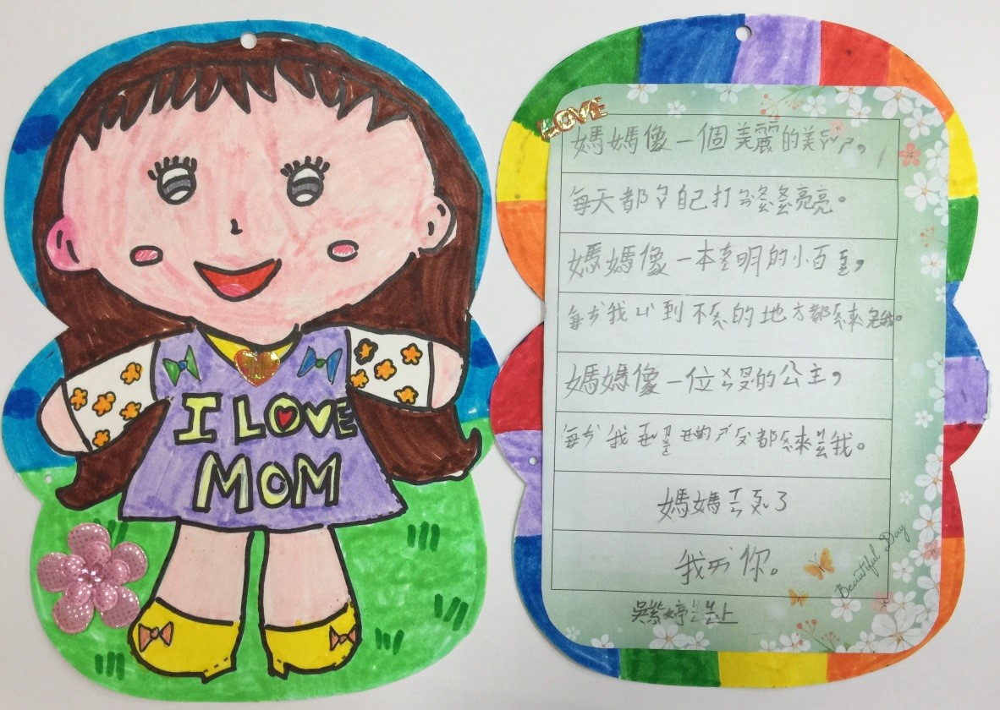

〈我們的家〉周卉瑜
==================

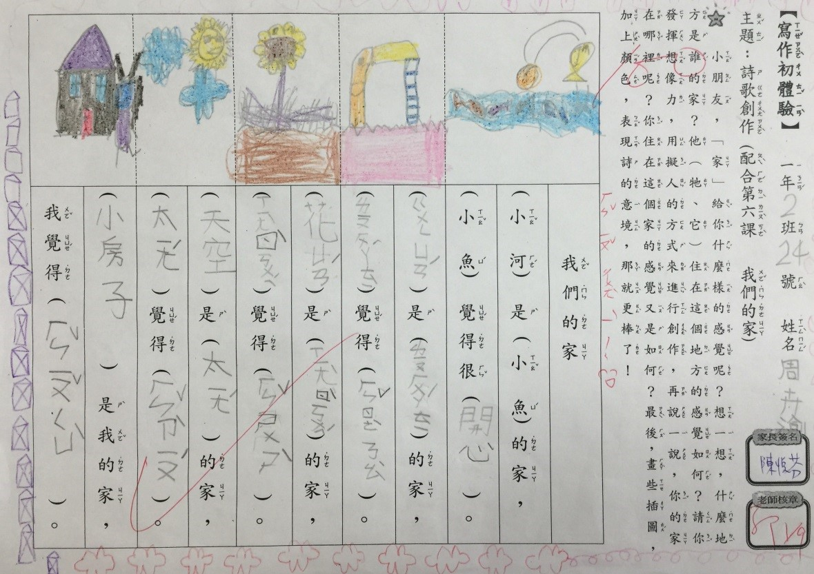

〈我們的家〉陳秉鋐
==================

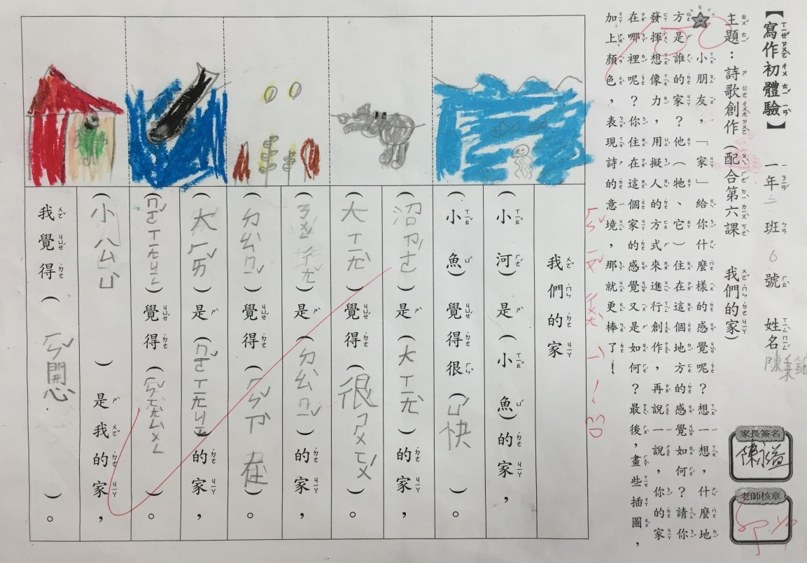

〈給爸爸的卡片〉謝姿亭
======================

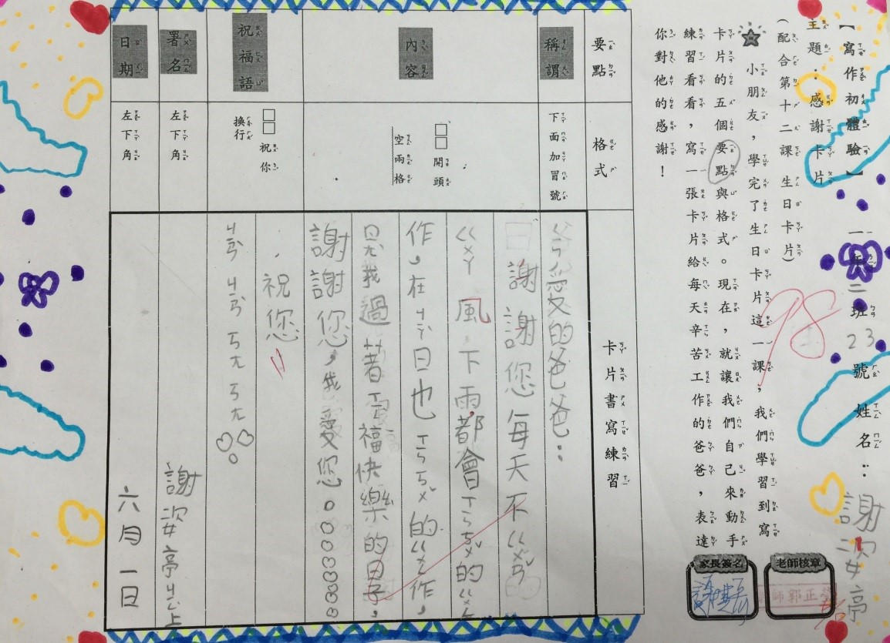

〈給爸爸的卡片〉孔令瑋
======================

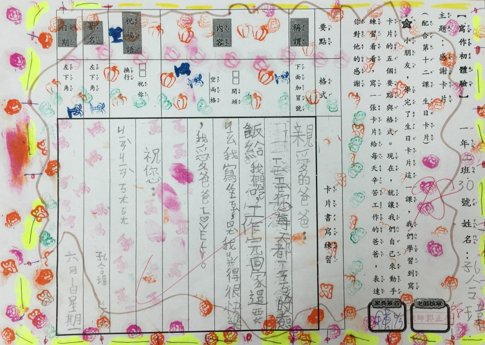

〈給爸爸的卡片〉陳馨柔
======================

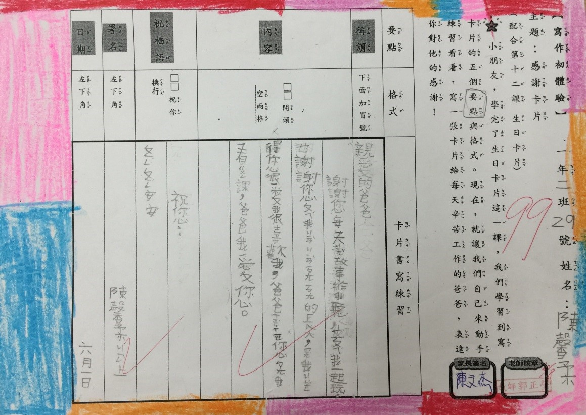

〈和你在一起〉劉宥妘
====================

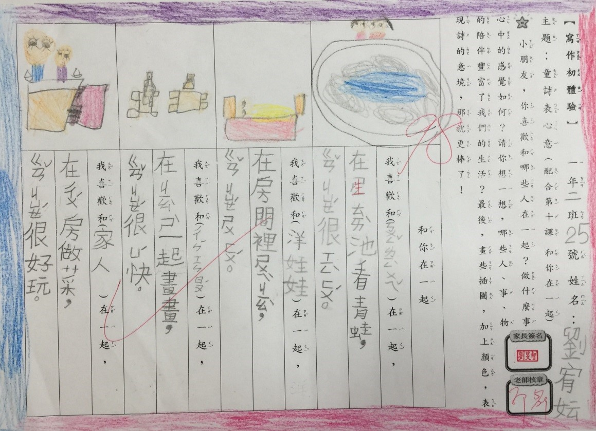

〈和你在一起〉王柏允
====================

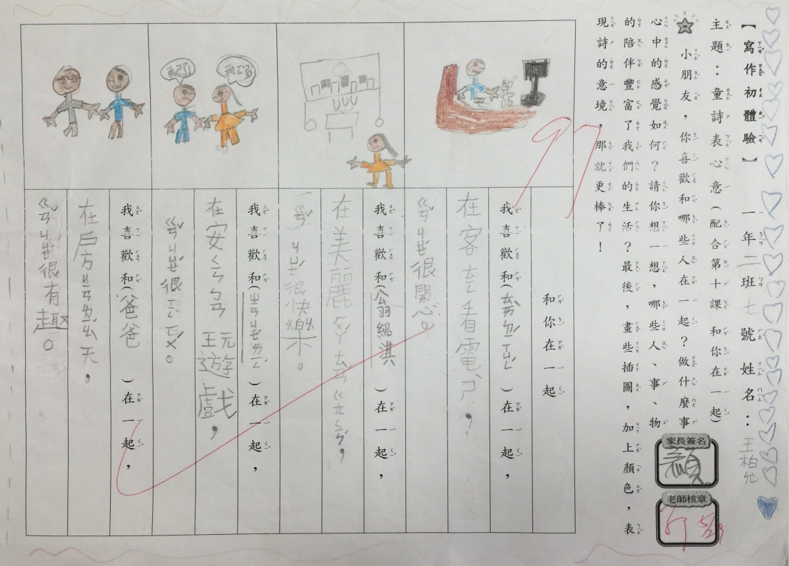

〈和你在一起〉鍾欣妤
====================

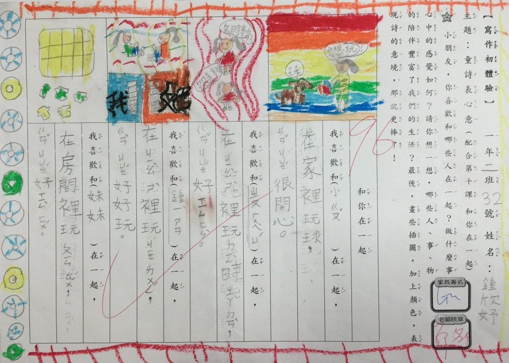

〈和你在一起〉周卉瑜
====================

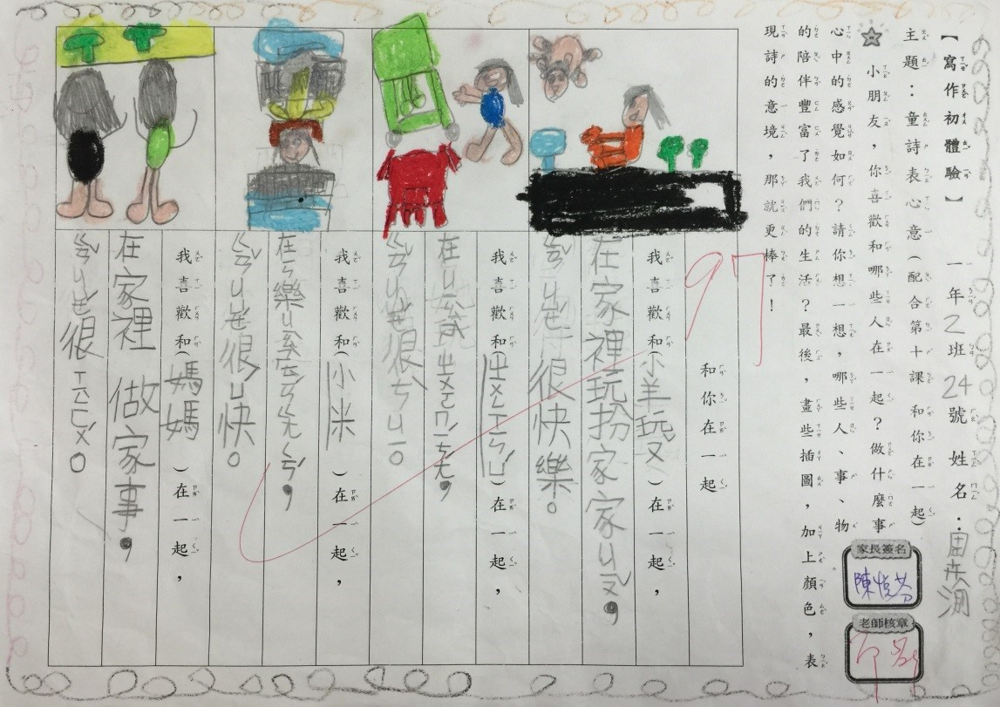

〈和你在一起〉王柏允
====================

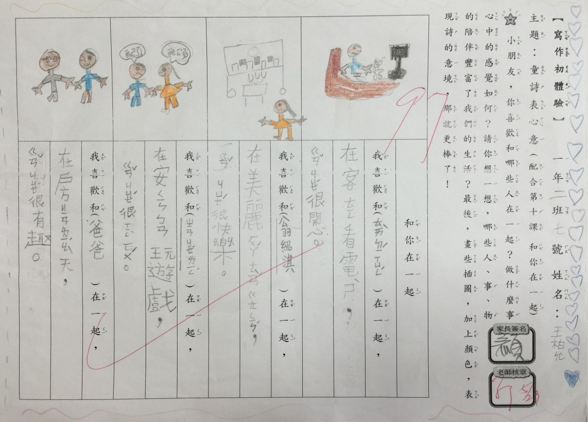

〈和你在一起〉鍾易珊
====================

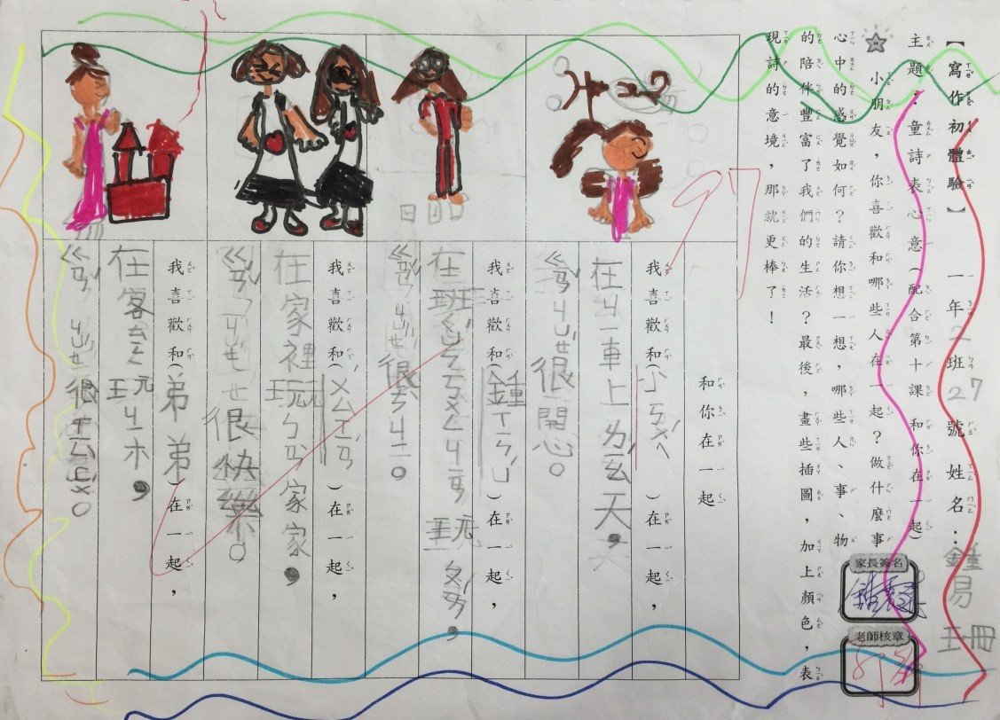

〈和你在一起〉陳馨柔
====================

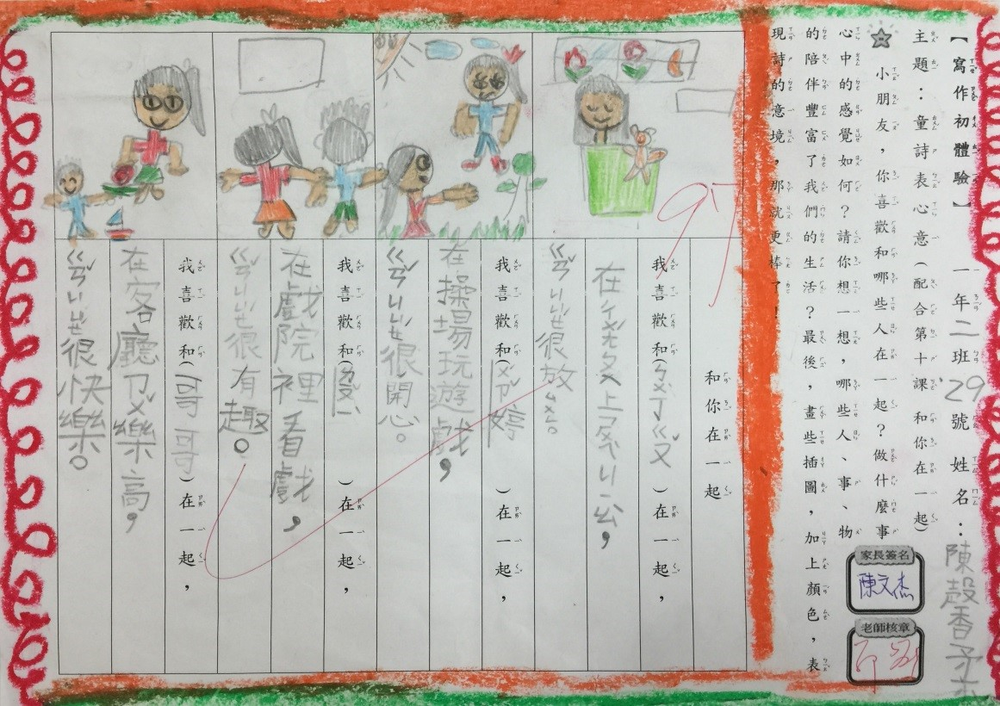

