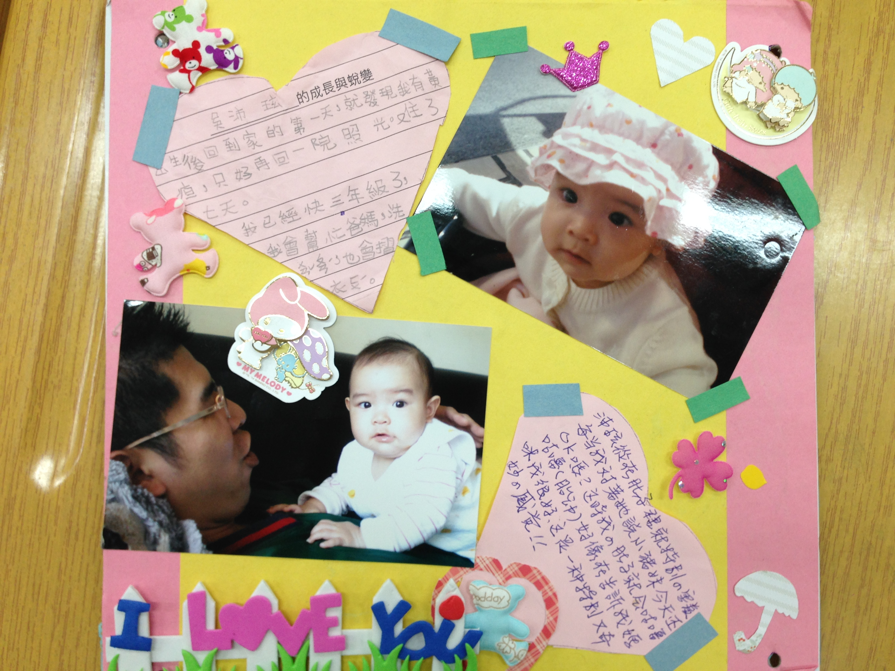
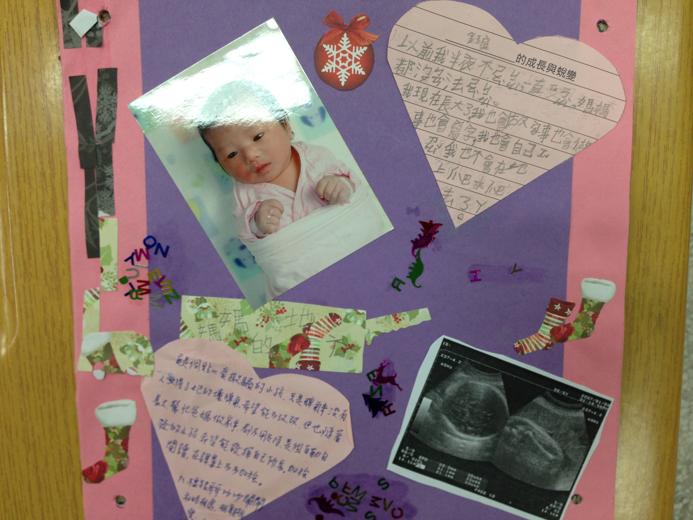
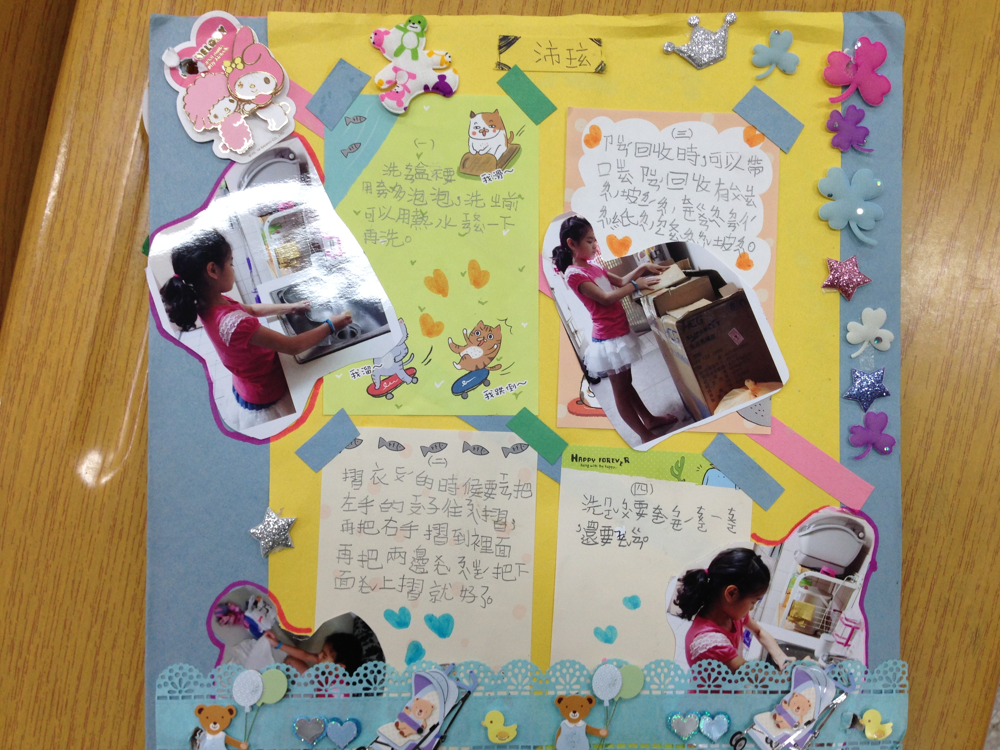
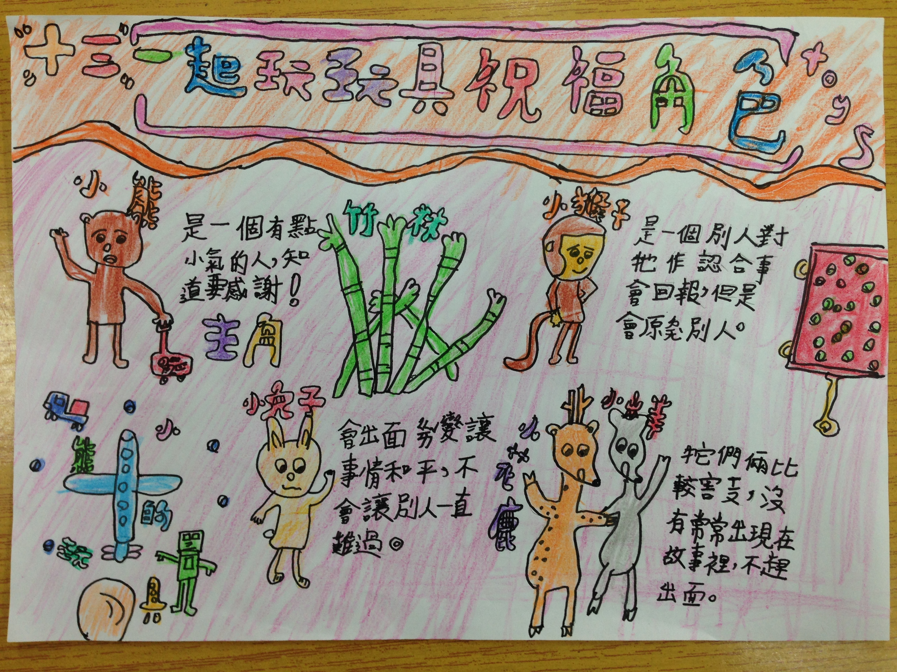

========
二年一班
========

.. figure:: 201/刮畫彩色的世界-王崇銘.JPG
    :align: center
    
    刮畫彩色的世界-王崇銘

.. figure:: 201/刮畫森林裡的大鳥生蛋了-謝睿軒.JPG
    :align: center
    
    刮畫森林裡的大鳥生蛋了-謝睿軒

.. figure:: 201/刮畫森林裡的美麗小花-郭家維.JPG
    :align: center
    
    刮畫森林裡的美麗小花-郭家維

.. figure:: 201/印尼樂器體驗-呂彥寧.JPG
    :align: center
    
    印尼樂器體驗-呂彥寧

.. figure:: 201/印尼樂器體驗-戴維里.JPG
    :align: center
    
    印尼樂器體驗-戴維里

.. figure:: 201/快樂迎新年-許淳雅.JPG
    :align: center
    
    快樂迎新年-許淳雅

.. figure:: 201/成語故事畫蛇添足-王寶嬅.JPG
    :align: center
    
    成語故事畫蛇添足-王寶嬅

    
    成長方塊版-吳沛玹

    
    成長方塊版-邱鈺庭

    
    我會做家事

.. figure:: 201/拜訪社區-吳沛玹.JPG
    :align: center
    
    拜訪社區-吳沛玹

.. figure:: 201/校外教學-郭元益糕餅舖.JPG
    :align: center
    
    校外教學-郭元益糕餅舖

.. figure:: 201/海底世界撕貼畫-溫致威.JPG
    :align: center
    
    海底世界撕貼畫-溫致威

.. figure:: 201/藍色公路-呂尚哲.JPG
    :align: center
    
    藍色公路-呂尚哲

.. figure:: 201/課文圖猴子撈月亮-黃靖雅.JPG
    :align: center
    
    課文圖猴子撈月亮-黃靖雅

.. figure:: 201/課文圖角和腳-葉承恩.JPG
    :align: center
    
    課文圖角和腳-葉承恩

    
    課文延伸活動角和腳-呂彥寧
