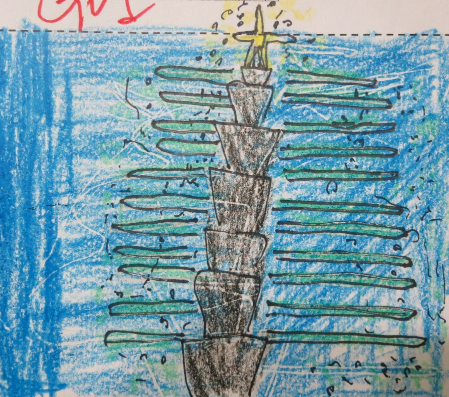
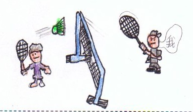

========
二年三班
========

老師的話
========
二年三班在這一年中一起經歷好多事，像是，濱江國小熱鬧滾滾的運動會、冬旦搓湯圓及以慶祝元旦，迎接新年。更棒的是每個孩子都長大了，個個成為家事小幫手，也通過護蛋大挑戰，更能體會媽媽懷孕的辛勞呢！

在圖畫小日記中，孩子除了能自我介紹獨一無二的自我特質外，也寫下對好朋友的觀察與收。歡迎大家欣賞二年三班的作品，也希望不吝嗇能給予二年三班最大的掌聲哦！

〈冬至搓湯圓〉 沈育家
=====================
今天是冬天，習俗上是全家團圓的日子。老師準備了糯米糰讓我們搓湯圓。

我們先把糯米糰揉成長條狀，然後把長條狀的糯米糰分成一小段，搓成湯圓，再把湯圓煮熟，湯圓就完成了。

煮好的湯圓又胖又圓，真可愛，讓人食指大動。湯圓吃起來香香甜甜的，真好吃。我希望每天都可以吃到湯圓，這樣就可以快快長大。

〈冬至搓湯圓〉 邱靖雯
=====================
今天是冬至，冬至是一年中白天最短，冬天最長的日子。冬至這天要吃湯圓，表示添了一歲，全家團圓。老師準備了紅白兩種顏色的糯米糰，愛心爸爸媽媽們也煮了一大鍋的紅豆湯。

我先把有點硬的糯米糰揉成QQ軟軟的，再把它搓成長條狀，分成一段段，最後把它搓成圓形，這樣就大功告成了。

煮好的湯圓加上好喝的紅頭湯，讓我食指大動，看到的湯圓美味可口，到處香氣撲鼻，吃到讚不絕口。吃完湯圓表示我又長了一歲，我要負責任，不要再讓爸媽擔心。

〈慶元旦迎新年〉 黃冠銘
=======================
元旦假期到了，我覺得很興奮。我和家人計畫要去美堤河濱公園看煙火，還有去外婆和奶奶家玩。

我最難忘的活動是去美堤河濱公園看101的跨年煙火，煙火好像一朵朵五彩繽紛的小花，有紅、黃和橘色的煙火，形狀好像耶誕樹，也好像龍捲風。

元旦假期要結束了，我覺得有點不開心。面對新的一年來臨，我希望自己可以趕快長大，迎接新的挑戰。

〈慶元旦迎新年〉 潘沐妍
=======================
元旦假期到了，我的心情很興奮。我們打算去台中二阿姨家玩，順便參觀台中科博館。

這次去台中最好玩的是去逛夜市。夜市裡有各式各樣好吃的食物和有趣的遊戲。我最喜歡玩套圈圈，可是我沒套中，姨丈套中了二隻像彩虹的三色筆，他把三色筆送給我和妹妹。

元旦假期要結束了，我的心情很滿足。面對新的一年來臨，我的新希望是上課可以更專心，要早睡早起保持好精神。

〈護蛋大挑戰〉 李育德
=====================
星期二那天，二年級學生舉行了護蛋活動。我的心情又興奮又緊張，因為即將有一個小生命要生出來了，我要努力把蛋留下來。

經過三個小時，我的身體感到有點難受，因為需要保護它，又要小心翼翼的走路很難。最困難的地方是行動不方便，很難走路。用手抱著肚子可以減少困難，走路用螃蟹方式橫著走，可以好走一點，或是身體向後變一點，然後腳大步大步打開走也可以。

我物得媽媽懷著我時很辛苦，因為我以前是個巨嬰，我以後要好好孝順媽媽，乖乖的長大。

〈護蛋大挑戰〉 蘇筱惠
=====================
參加這次護蛋活動，一拿到蛋時，我覺得面對這個新生命，有一點緊張，因為我怕那顆蛋會很快就破掉。

從第三個月到第七個月，我覺得很煩惱，因為背著蛋做事情很難。我覺得最不方便的地方是走路不能走很快，而且很難控制走路的速度。所以我就忍耐著，試著控制自己，我勉強慢慢的走。

經歷過這個活動，讓我體會媽媽生我的辛苦，而且我們只有七個小時，媽媽生我們下來卻要十個月的時間，所以媽媽一定吃了不少苦頭。

〈家事小幫手〉 賴祈臻
=====================
爸爸平日上班，假日都會幫忙煮飯，媽媽會洗衣服，媽媽會洗地板，至於我，我會幫忙擦桌子。

我最近學會了兩件家事，有洗餐盒，還有擰抹布。洗餐盒的步驟很簡單，首先打開餐盒，用水沖乾淨，接著擠肥皂，用海棉將碗內外刷乾淨，最後用水沖淨，就大功告成了。再來就是擰抺布，先擰出一些水，然後兩端對摺，最後用力反轉。

雖然我年紀還小，可以已經可以幫忙做很多家事，爸爸媽媽也稱讚我很棒哦！

〈家事小幫手〉 馬玉安
=====================
家是全家人的，所以家人都要共同分擔家事，例如：爸爸負責倒垃圾、洗衣服，媽媽負責拖地、曬衣服，哥哥負責收衣服，至於我就負責摺衣服。

最近，我新學會的兩件家事是吸地板和洗餐盒。吸地板時，要注意將家裡的每個塊地板都吸乾淨，特別是角落不要留下骯髒的灰塵；而洗餐盒時，要注要把上面的油漬和髒汙刷洗乾淨，最後還要檢查上面的泡抺有沒有沖洗乾淨。

我覺得能夠將家裡的地板吸乾淨，感覺非常驕傲，因為我能夠把骯髒的地板變成一塵不染，爸爸和媽媽都稱讚我是個家事小幫手。

.. figure:: 203/image8.jpeg
    :align: center

〈我的好朋友〉 鍾定言
=====================
我的好朋友長得不高也不矮，他的武術很厲害，跑步非常快。他喜歡互相比較。他的名字叫紀威宇。

我們常在課後班一起玩「我的遊戲」。有一次，我們在比誰跑步跑得快，結果他輸了，卻有點生氣。我對他說：「這次輸了沒關係，下次再贏回來。」他的心情就舒服一些。而另一次在課後班時，他也創造了一個遊戲和我一起玩，那時我們玩得非常快樂。和他在一起，我覺得和朋友一起生活，日子就過得很開心。

有他在的日子像是在天堂，沒有他的日子像是在地獄。我想對他說：「雖然你轉學了，但希望你在新學校可以過得更好。」

〈自我介紹〉 鍾沐樵
===================
我是一個愛看書的男生，我喜歡一面躺著，一面看書，不館媽媽催我吃飯或是睡覺。只要拿起書本，我就聽不到媽媽的聲音，也聽不見電話的鈴聲，我就會想出更多精采的內容。

我是一個愛打羽球的男生，我喜歡一面跑步，一面打球，不管是汗流沃背或是腳酸得不得了。但只要拿起球拍，我就能一直打，就連下課鐘響，我都聽不見。我沉浸在羽球的世界裡。

〈自我介紹〉 王庠淞
===================
我是一個愛打桌球的小男孩，我喜歡一面跑步，一面打桌球，不管天色多晚或是身體多累，只要拿起球拍，我就會打起精神認真打桌球。

我是一個愛畫圖的小男孩，我喜歡一面畫圖，一面哼歌，不管戶外寫生還是靜態素描，只要拿出色筆，我就會畫出一幅幅美麗的圖畫。

〈第一次〉 王子瑞
=================
我記得第一次拔牙的時候，一聽到牙醫叫我的名字時，我一邊發抖，一邊慢慢的走進去，躺在自動椅上，聽到牙醫拿起拔牙機時，發出「ㄥㄥ」的聲音，當時我的心情很害怕。

我記得第一次打羽毛球，當時我的心情很期待，因為期待學會的時刻，還可以跟別人比賽，但卻有點害怕，因為怕訓練的辛苦，讓我生氣。

我記得第一次學彈鋼琴，我的心情很緊張，因為在別人家裡學，又是第一次見到鋼琴老師。

生活中有許多的第一次，不論是緊張、期待或是害怕的，都值得我去體會。

〈自我介紹〉 張怡雯
===================
我是一個愛畫畫的女孩，我喜歡一面畫畫，一面哼歌，不管是什麼景像，只要拿起畫筆，我就會一一畫出美麗的圖畫。

我是一個愛跳舞的女孩，我喜歡一面跳舞，一面唱歌，不管是溫柔歌曲，或是輕快的進行曲，只要有音樂，我就能隨著旋律起舞。

〈自我介紹〉 蔡宜珊
===================
我是一個愛運動的小孩，我喜歡一面跑步，一面聊天，不管是和家人或是和同學一起，只要去跑步，我就會開心的和他們一起談天說地。

我是一個愛畫畫的小孩，我喜歡一面畫畫，一面看風景，不管畫的是晴天或是雨天，只要一拿起畫筆，我就會畫下一張張美麗的圖畫。

〈我的好朋友〉 林子涵
=====================
我的好朋友是賴威丞，他個子瘦瘦小小的，而且有戴眼鏡。他喜歡看書，他的個性很溫和，像無尾熊一樣可愛。

我們有時會一起進校門，一起談天說笑，然後再進教室，有時我們會一起看書，分享有趣的事物和知識。雖然偶爾他會突然就跑走，但是我總是找到他。我從他身上學到原來閱讀可以增加知識，讓我也漸漸的開始喜歡看書。

有他在的日子，我會感到很快樂，如果沒有他就沒有人和我分享書的好處和樂趣。我想對他說：「謝謝你和我分享看書的樂趣。」

