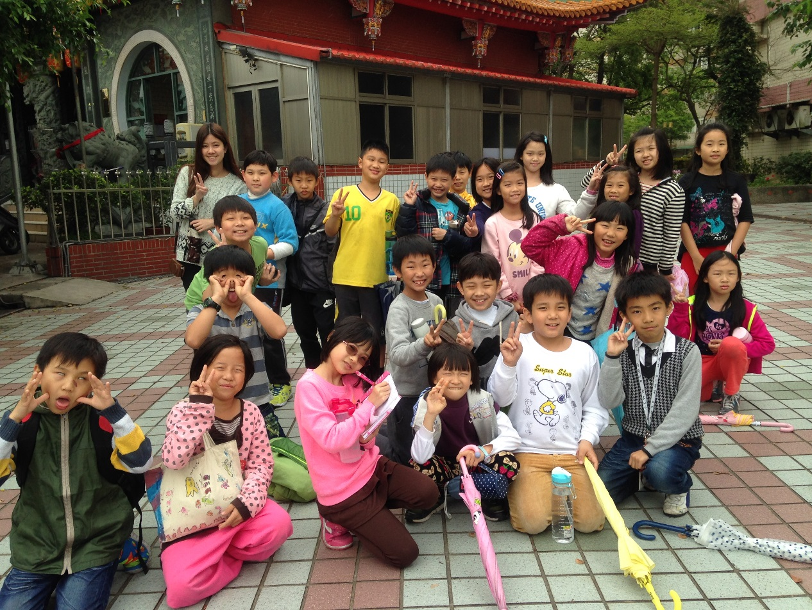

========
三年一班
========

老師的話
========

時光飛逝，三年級的歲月已接近尾聲。小朋友上學期第一次接觸作文，從剛開始不知如何下筆，到現在能自己蒐集資料、觀察事物，進而完成一篇作文，這樣的轉變雖不算突飛猛進，卻也明顯感受到他們的進步與努力。以下就來看看從小朋友的觀點，美食、玩具與大家庭濱江國小，各有什麼樣不同的面貌吧！

《吃披薩的感覺》鄧喬予
======================
今天我要介紹的食物是披薩，披薩的外表是三角形，餅皮是橘色的，上面還會加上一些鳳梨、火腿、蔬菜，看起來真可口。

披薩是在十九世紀末正式於歷史上登場。傳說將披薩這樣食物打開知名度，是深受十九世紀時期義大利瑪格利特王妃的影響。她對平民所吃的披薩很有興趣，於是在西元一八八九年六月有一位師傅就將披薩創造出來。
吃披薩的時候，會聽到的聲音是ㄎㄚㄘㄎㄚㄘ呢！而且聞到的味道有烤火腿的氣味，摸起來感覺軟軟的，吃起來就會讓人升天了呢！

有一年的母親節，我和家人一起吃披薩，那種味道令人一吃就忘不了。有一次我生日也叫了必勝客的夏威夷披薩，還有媽媽和爸爸最喜歡的和風章魚燒口味，我的弟弟、舅舅、舅媽、大姨、外婆和外公都到我的家來慶祝，真是一個難忘的回憶。

我很喜歡吃披薩，希望爸爸和媽媽常常帶我和弟弟去吃披薩。

《吃巧克力的感覺》黃再年
========================
我喜歡吃的東西有很多，比如：牛奶、香蕉、蘿蔔糕、蘋果、芭樂、洋芋片、可樂果、麵、海苔，其中我最喜歡吃的是巧克力。
它的外型是正方形，顏色是咖啡色，吃的時候聽到的聲音是「喀、喀」，聞起來香香、甜甜的，摸起來冰冰、涼涼的，但是摸太久就會慢慢的溶化。它的好處是可以補充熱量，所以巧克力都是登山者的最愛。關於巧克力有名的故事是「巧克力女孩」，內容是有一個小女孩很喜歡吃巧克力，最後就變成了巧克力！

巧克力上面有很多種不同圖案，它吃起來甜甜的，吃的時候心裡感覺非常幸福，好像要上天堂了。以上是我幫我最喜歡的食物─巧克力所做的介紹。

謝謝做巧克力的人，我以後也要學做巧克力，讓更多人感受到品嘗美食的幸福。

《我最愛的玩具》陳恩湛
======================
我最喜歡的玩具是遙控跑車，它的外型有導流板，也有很好看的輪軸和燈，那個燈很賞心悅目呢！

我會喜歡的原因是之前阿公帶我去買玩具的時候，我就找到了遙控跑車，從此我就很喜歡這個玩具了。

我的遙控跑車陪著我度過了美好時光，當我無聊時，就會想起它。我在玩的時候，總是玩得樂不思蜀，把悲傷和難過都忘了，心情也好了許多。當我開心的時候，當然也會想到這個好玩的遙控跑車。玩的時候常感覺到一陣陣愉悅，那種愉悅是一種很特別的愉悅，是一種格外的愉悅，心情非常的高興、快樂和開心呢！

我覺得這個玩具遙控跑車和我留下許多好的回憶，真希望這個好玩的遙控跑車可以陪我直到永遠。

《我最愛的玩具》陳彥斌
======================
我今天要跟大家介紹的玩具是樂高，樂高來自美國，它的名字是由英文 Lego 翻譯的。它是一個可以自由組裝的玩具，能夠激發玩者的創意。

我是在美麗華發現樂高的。某一天，爸爸媽媽帶我到百貨公司挑選生日禮物，我第一眼看到的玩具就是樂高，於是就將它買了下來。後來我發現樂高越玩越好玩，所以我又買了很多樂高，因此樂高自然成為我最喜歡的玩具。樂高有各種不同的裝備和系列，例如：城市、星際大戰系列；對講機、刀槍裝備等。而藉由樂高可以自由組裝的特性，能讓玩者組裝出不同的東西，例如船、車等。

我覺得可以把樂高推薦給我所有朋友，因為在組樂高的過程中，有一種無法形容的快樂心情，所以我想讓大家都能感受這樣的心情。

《我最喜歡的玩具》呂婉韶
========================
我最喜歡的玩具是「我的小熊維尼」，因為它很可愛，也是我爸爸從迪士尼買回來的。當時因為妹妹也有，所以他也買一個給我。之後小熊維尼就變成了我最喜歡的玩具。

它的身體是黃色的，衣服是紅色的，眼睛是咖啡色的。我有時候還會把妹妹小時候的衣服給小熊維尼穿，或是把髮夾、吊飾掛在它的耳朵上，我覺得它真的很可愛！

我有時會跟它說話，或跟它一起睡覺，也會把它當成球來玩。妹妹和我有時候喜歡學它講話，之後我再把我們講的話錄下來做紀念。每次無聊的時候，就可以看我自己錄的影片。

當時我拿到小熊維尼非常開心，因為我又多得到一個娃娃了。當我傷心的時候，小熊維尼就像我的好朋友陪伴著我，所以我要謝謝爸爸買給我這個娃娃。

《我最心愛的玩具小狗》周子遊
============================
我這隻小狗它的名字叫狗狗，它是在我一歲時，我爸爸的老師給我的小禮物，它已經和我在一起十多年了。

狗狗它有著一雙黑黑亮亮的小眼睛，一對長長圓圓的耳朵，手腳也是圓圓的，掌心是白色的。它還有一個大大黑黑的鼻子，旁邊有著像雪一樣白的毛，其它地方則是淺咖啡色的，脖子上還繫了一個蝴蝶結。

我和它度過的時光都是在跟它一起睡覺，或和它的兄弟姊妹，也就是我其它的玩具一起拍一些小片子。我們在拍片子的時候都是在拍它們說相聲、唱歌跳舞或說故事。

我很謝謝狗狗陪我這麼多年，和我一起拍小片子、一起睡覺。我小時候很常拿著它到處跑，我覺得和它在一起的時候都很開心。

《美麗的校園》龔子穎
====================
我喜歡上學，因為校園裡總是會有許多地方值得我和張念芯利用下課時間來探險及參觀。我最喜歡這段時間，因為可以讓我們更進一步認識校園。

一走進校園，最先看到親切的警衛對我招手。接下來看到一道五顏六色的樓梯，就像通往天國的階梯。我還有看到學校的特殊藝術品─小水滴，因為上面有特別的圖案和文字，讓我印象深刻。

而我覺得校園裡最特別的地方是三樓英語情境中心，因為那裡有英師和我們互動，加上佈置成美國的景象，讓我就像來到美國一樣。

我最喜歡的角落是水波遊戲場，因為當你快速走動，你會看到有魚在游和蜻蜓在飛。有時我會一邊和我表弟玩，一邊欣賞魚兒們的游動。

我覺得濱江國小很特別，因為它的形狀是圓弧形的。我希望未來學校可以多建一些遊樂設施，也可以多種一些樹來綠化校園。　

《美麗的校園》陳柔安
====================
濱江國小是我上學的地方，也是我覺得最漂亮、最特別的國小。

一進校門，會先看到五顏六色的樓梯，樓梯上的顏色分別是紅、橙、黃、綠、藍、靛、紫。你一定會覺得這幾種顏色很熟悉，沒錯！就是彩虹的顏色。

五彩繽紛的樓梯旁，就是我覺得校園中最有特色的建築─水滴廣場。可愛的水滴，就像濱江國小的守護神，天天保護著校園中的每一位學生。

再往前走，就是最美麗的藝術品─虹彩耀濱。這個藝術品是由一些奇形怪狀的磚塊拼湊而成的，讓人看得目不暇給。

透過這篇文章，相信大家一定更進一步了解濱江國小。希望大家可以愛護這間美麗的學校。

《美麗的校園》李彥劭
====================
一進校門，我就已經覺得學校很美麗，因為外面的牆很像羅馬競技場，還有一格一格的小洞，會讓走進去的人大吃一驚！

再進去就是美麗的水滴廣場，這裡有一顆非常大的水滴，下面還有磚頭蓋的「BJ」字樣，真是漂亮，看了心情也會格外開心。

往前走就是虹彩耀濱，那邊很寬敞，適合玩遊戲，也可以運動。當操場被雨淋濕時，虹彩耀濱就會是同學們的「運動場」。

去地下室時，就會看到好玩又可愛的種子遊戲區，那邊有許多水果向我們介紹自己，還可以玩鬼抓人、躲貓貓，大家經常玩得不亦樂乎！

另一個特別的地方是生態池，那裡有許多水生植物或生物，我覺得很豐富，也讓全校變得更有特色。我覺得濱江國小是全世界最漂亮的建築物！

