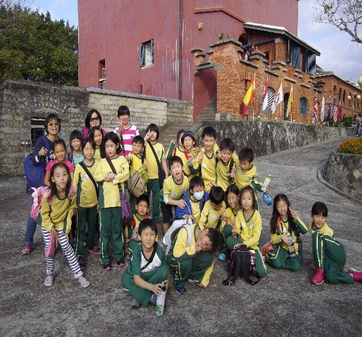
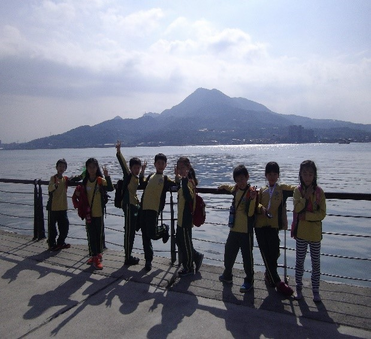

========
三年三班
========

    

校外教學之旅 郭哲瑋
===================
讓我期待已久的校外教學終於來臨了，我興奮得睡不著覺,凌晨起來好多次，怕起不來，所以早上六就起來了。

今天是十月十一日，天氣很晴朗,我們早上八點二時出發，第一站是紅樹林生態保育館，那邊的叔叔為我們講解紅樹林的由來，有幾種生物和地理，讓我們印象深刻。

第二站是淡水老街，富有傳統文化的老街，人來人往有琳瑯滿目的古玩，以及香味四溢的小吃，我以前都是晚上去,，只有這次早上去，我覺得新奇又有趣,之後我花了五十元買鐵但請大家吃呢! 害我都不能買魚酥帶回家給媽媽和爸爸吃。

最後一站紅毛城，紅毛城歷經無數的戰爭，依然靜靜的保衛著淡水河口，它裡面監獄、焚化爐、放風口，遠望這座老城 ，忍不住想起三百多年前的臺灣，留給人們無數的感嘆。

我每次都是從書上和電視上才能看到紅毛城，透過這次的校外教學，讓我真正體會到紅毛城的歷史與雄偉，進一步了解了淡水在臺灣除了地理位子上的重要，更與歷史有著更密不可分的關係，此次的旅程讓我滿載而歸。

我的好朋友 吳翔曜
=================
我有一個最要好的朋友，名叫柯王翔也是我第一個好朋友。他不但數學很好，英文也很流利，讓我很羨慕。

每當下課的時候，我都會找柯王翔一起出去玩，我們玩鬼抓人的時侯，他總是跑得很快，不會被抓到，也難怪他是我們班上大隊接力的最後一棒。當我沒帶筆的時候，他總是第一個借我筆的人，他很善良，每當我哭的時候，他都會問我怎麼了、還會安慰我。

他很害羞，每次跟我說話的時候都很大聲，可是上臺講話的時候都很小聲，害我們在臺下的人都聽不到他講話的聲音。我的好朋友，很愛踢足球，每次我們聊到世界盃足球的時候，都特別興奮，只要是關於足球的事情他都特別關心。

我有一個最知心的好朋友，他會協助我，讓我很謝謝他，也謝謝他願意跟我做好朋友。每當想到他的時候，我都會想起我跟他玩的快樂時光。

體驗活動 李啟嘉
===============
在我做這些活動前，非常好奇活動的內容是什麼？我們非常興奮，大家的心情也很緊張。但老師告訴我們活動項目後，大家都不緊張了。

所謂的聾啞體驗就是無法說話的意思。當老師告訴我們這個體驗實，大家都以為一整天不能說話（連我也不例外）都嚇的不得了。幸好後來老師說：「其實不用一整天都不說話，只要在下課不說話和上課老師沒有叫你說話時不說話就好。」這時大家才鬆了一口氣。

在體驗過程中，整個下課都不能說話非常難受，偶爾也會不小心說出話來，真是可怕啊！後來，終於渡過聾啞體驗了。不過還有兩個體驗呢！

經過這次體驗，我發現，有些殘障人士無法與人溝通，有些人永遠都只能看見黑暗，有些人無法用手吃飯，…等。生活中有許多需要幫助的人，因為他們缺少了一些他們本來該擁有的器官，所以我以後一定要多幫助他們。

我的媽媽 陳豊幃
===============
我的媽媽長得很高，漂亮又美麗。她每天都面帶微笑的來接我放學。有一次，我不小心打破杯子，媽媽不但沒有駡我，還問我有沒有受傷?!我覺得她是世界上最溫柔的媽媽。

我媽媽的個性很活潑，每次出去玩，她都會和不認識的人說話。她的興趣是畫畫丶看書和旅行，有一次她去旅行時，只帶繪畫本丶色鉛筆和三本書就出門了 ! 我媽媽的專長是寫文章及畫圖，去年過年，她送了一本她自己做的書給我當禮物呢！

但我的媽媽很怕蟑螂，每次她看到蟑螂就會驚聲尖叫，跑去拿拖鞋一直打，一直打。媽媽每天很早就起床，因為她要幫爸爸丶哥哥和我準備中午的便當，真是辛苦了。

我想對媽媽說:「謝謝您照顧我，我愛您 ! 我以後長大，一定會好好照顧您的，等我成為音樂家，我要買毛襪送給您 ! 讓您可以和我去世界各地表演。」

考試 彭邦睿
===========
每到快考試時，我就會想要努力複習，因為我想要把考試考好，如果可以把考試考好，就會很有成就感。

我覺得考試很刺激，因為我覺得要在短短四十分鐘內要寫完一張考卷有一點難，尤其是國語，因為我覺得我造句有點不通順。

我的好朋友 錢和
===============
我有一個很要好的朋友叫作王天一，他是我在濱江國小認識的第一個朋友。他有一頭短髮、很活潑、很愛穿藍色的衣服，而且長得很帥！

我們一、二年級是同班同學。我的個性比較迷糊，有時候忘了帶鉛筆、文具，他都會很大方地借給我。他很愛耍寶，脾氣也非常好，我們常常因為一些莫名其妙的小事，互看一眼後，笑得東倒西歪。他很喜歡踢足球，只要有一天沒踢，他就會渾身不舒服。所以每節下課，我們都會相約去操場踢球。我覺得他球技非常好，射門很強，速度又很快，有時候還會出現旋球，真是厲害。

他也很有正義感。記得有一次我被別人欺負，只有王天一來救我，他大聲地說：「不要再作弄他了！」讓我很感動。還有一次我被老師處罰要訂正完作業才能下課，大家都跑出去了，只有王天一留下來等我。

雖然現在我們不同班，但是偶爾還是有機會可以一起玩。有時候，我寫作業寫得很煩，抬頭看看坐在遠方的王天一，就又有力氣可以繼續寫了。我覺得能跟他同校，真是非常幸運的一件事，希望我們能是永遠的好朋友！

如果風是彩色的 施奕光
=====================
如果風是彩色的，它吹向大地，為萬物帶來繽紛的色彩。它為花朵帶來了紅色。它為鴨子帶來了黃色。它為青草帶來了綠色。它為大海帶來了藍色。希望風不是灰色的，因為灰色的風，會帶來狂風暴雨，讓我無法看到大地的美景。

我的假日旅遊 林倢宏
===================
今天我們到外婆家玩，看到外婆正在幫一隻名叫妞妞的小狗打針。我們原本以為妞妞會痛的亂吼亂叫，沒想到妞妞竟然只有「汪！汪！」的兩聲。

後來我們去看電視，然後回家，過了一個快樂的兒童節！

去奶奶家 張睿亞
===============
我很愛去奶奶家，可以看到好久不見的奶奶和舅舅,如果是星期五的話,舅舅就會帶我去夜市玩,買烤肉回奶奶家吃,奶奶會煮美味的飯給我們全家吃,我喜歡回奶奶家,因為奶奶家有好多美好的回憶。

給風加上顏色 柯王翔
===================
我要給風加上籃色，因為如果下暴風雪，這樣就可以滑雪了。我要把風加上紅色，因為就可以在外面煮關東煮了。我要把風加上橘色，因為會讓很冷的天氣變溫暖。

我的弟弟 許子翔
===============
我有一個最好的弟弟，名字叫作許世辰，他的眼睛小小的，長得跟我很像，他的興趣和專長是看電視、玩玩具、吃東西、畫畫……，當他生氣的時候總是會說：「我發火了！」
我的弟弟個性很活潑，他常常活蹦亂跳的。雖然學校一個星期有很多天可以穿便服，但是我的弟弟很特別，因為他很喜歡穿著永安國小的運動服到學校去，有時候還會戴永安帽呢！
我的弟弟很會吃，去年我們全家去吃大餐，大家才吃幾口時，弟弟卻己經吃完了，還吵著要吃第二碗，過一陣子之後吵著要第三碗……。我的弟弟很喜歡恐龍，有一次他跟爸爸吵著要一大盒恐龍模型，裡面有很多大大小小的恐龍和一本介紹恐龍的書，價格不斐，結果爸爸還把那盒玩具買下來了，因為弟弟非常寶貝那盒玩具都不給我玩，一直到現在還是不給我玩。
我有一個好弟弟，最知心的弟弟，當我無聊時，他會陪我玩；當我有困難時，他會安慰我並和陪我一起面對……，雖然我們有時候會吵架，但我們的感情還是沒變，而且只會越來越好呢！　　　　　　　　

體驗活動 蕭祈
=============
我看到劉大潭叔叔的身體這麼不方便，心想不知道劉大潭叔叔有什麼感覺?沒想到，老師正好說要我們體驗當一個身體殘障的人！這麼一來，我就可以知道劉大潭叔叔有什麼不方便的感受了！

今天我才剛到教室，梁佳恩就衝過來，小小聲的對我說：「今天不能說話!」但是我好想說話，所以只好用寫字的方式來對話，好麻煩喔！好幾次都不小心說出話來，想像如果我是一個聾啞人士，不知道要怎麼活下去?我好幸福呵！

隔天早上一到校門口，就想到今天要換視障體驗，我不禁加快腳步趕快進教室，到了體驗的時候,安婷帶著我去換鞋、裝水,在閉眼走的途中,我好像踢到什麼東西，啊！差一點就跌倒了！原來是一個小石頭，現在我終於知道視障是多麼不方便,我要多關心視障的人，以及愛護自己的雙眼。

老師利用這次的體驗活動，讓我們知道殘障的人有多麼不便，我覺得殘障的人好可憐喔！我長大後要當一個志工，這樣就可以幫助殘障的人了！

體驗活動 鄭安婷
===============
經過劉大潭叔叔的演講之後，老師要讓我們體驗殘障人士的不便，有三個體驗，分別是聾啞、視障和肢障，我們都很期待。

第一個是聾啞體驗，我們一開始進行得很順利，但後來才發現很辛苦有時候我們都會不小心恢復正常地說出來，因為要我們比手畫腳表達事物真的很不容易。

第二個是肢障體驗，我覺得這是最難的體驗，因為要一隻手吃飯、刷牙，盛湯的時候要兩個人同心合力才可以，喝湯的時候也很容易打翻。

我覺得殘障人士很可憐，我真的很幸福，有那些器官，可以說話、可以看這美麗的世界、也有這雙手做事情，我以後要常常幫助殘障人士。

淡水校外教學 黃芃睿
===================
老師說我們要先去紅樹林生態教育館 ，再去淡水老街、紅毛城。要出去時，我很期待看到紅毛城，因為課本裡的紅毛城看起來很漂亮，所以我想看看它是不是像課本裡的一樣漂亮。

我們先到紅樹林生態館，黃哥哥帶我們參觀、介紹大自然，有水筆仔、彈塗魚、招潮蟹，他還告訴我們牠們覓食、交配等知識。雖然不能去走步道，但是黃哥哥卻介紹了許多關於水筆仔的知識，非常的有趣。

到了淡水以後，我們開始吃美味的午餐。吃完午餐，我去淡水老街，那裡有許多遊客，也有許多好吃又好玩的東西。我們去射氣球時，看到美麗的淡水河，也看到有人在河邊釣魚。

再來我們去紅毛城，紅毛城裡古老的物品很漂亮，牢房裡面的犯人，像真的一樣，旁邊有翠綠的草坪，草坪上有以前的砲台，西洋建築的門口，有刮泥板，還有華麗的雕飾。

我很高興可以和大家一起出去玩，希望下次還有機會可以再和大家一起去走一走。

體驗活動 張哲寧
===============
我們這禮拜要體驗的活動很辛苦，因為老師有一天突然，介紹一位很神秘的人物給我們，這位神祕地的人物就是劉大潭叔叔。

他三歲時，打了過期的預防針，從這時候開始，他有一個艱難的大考驗，可是他卻克服了他的困難，所以老師想到了一個可以互相為別人著想的活動，老師就說我們這禮拜要進行三天的體驗活動。

體驗那天終於來了，我們大家都很興奮，我們大家的嘴巴都閉得緊緊的，很多人到了中午就開始講話了，所以老師就要我們如果三次機會都用完的話就要再重做一次體驗。到了第二個體驗，我更興奮了，這次的體驗是視障。我們開始體驗，一開始我看邱芷妍體驗，看起來很簡單，可是換我的時候卻感覺很可怕，我怕會跌倒，也怕會撞牆壁，可是我卻過關了，我很開心，也很有成就感。

經過這些體驗，我覺得我們應該要學會幫助有障礙的人。

體驗活動 吳昀霏
===============
上週是三年級的體驗週,而且是經過劉大潭叔叔精彩的演講之後才開始的,星期二是我們的第一個體驗,我們體驗的是聾啞,星期三體驗的是視障,星期四體驗的是肢障,因為有那麼多的體驗,讓我有許多的期待。

第一個體驗是聾啞,一開始大家以為可以很順利,但是後來才發現其實不容易,因為有時候別人比手畫腳的內容不知道也看不懂,所以很麻煩.

第二個體驗是肢障,我覺得這個體驗是最難的,因為只能用一隻手吃飯和盛飯和刷牙,而且是用不習慣的手.盛飯的困難是要盛很久,因為不習慣的手力氣沒那麼大,吃飯的困難也一樣,刷牙最難,因為要用一隻手擠牙膏,光擠牙膏我就擠了一分鐘.

我覺得這些體驗真的讓我體驗到了殘障者的不便,所以以後我看到殘障一定要幫助他們.

淡水之旅 柴芊茵
===============
今天天氣晴朗，陽光普照，很適合旅遊。這天也是我們去淡水玩的一天，我一看到這個天氣就很開心，希望我們可以過的很完美。

一大早我就迫不及待的跑去上學。首先我們去紅樹林生態教育館，老師教我們很多關於水筆仔和招潮蟹的知識。接著我們來到紅毛城，紅紅的建築，靜靜的聳立在山坡上，就像一位老人，安靜的望著河口，回憶過去的時光。紅毛城和生態館的老師細心介紹，讓我對淡水有了更深一層的了解。

接下來我們來到人來人往的淡水老街。走在街道上，此起彼落的叫賣聲不絕於耳。每樣傳統的小吃，看起來都很美味，令人垂涎三尺，讓我每一樣都想嘗一口。

這次的淡水之旅，讓我們體會到淡水的小吃和風景，我也學到了很多淡水及紅樹林相關的知識，希望下次還可以再去一次。

淡水之旅 蔣甯恩
===============
早上八點二十分,是我們三年級戶外教學的時刻,車子開了,車上有嘰嘰喳喳的吵鬧聲,有開開心心的歡笑聲,我既期待又緊張,我好想趕快到那裡.

我們先去有各式各樣商店的淡水老街,那裡有;玩具,鐵蛋,鍋碗瓢盆,糖果等,在那裡我買了 小兔子玩偶,糖果,我們這組還去淡水老街照相！我看到我爸爸,媽媽來跟蹤我們這組呢！我還吃到聞名已久的阿婆鐵蛋,它愈嚼愈香,讓我一顆接著一顆吃個不停.

接著我們去蒼老的紅毛城,我看到了古時關戰孚的地牢,牢裡面有假的犯人,他們長的好醜又好好笑.英國領事館房子前面有個刮泥板,那時淡水天氣很潮濕,那是用來把腳上泥土刮掉的 .

淡水的夕陽,蒼老的紅毛城,總是令人那麼著迷,我也深深愛上它了.

螢火蟲 邱芷妍
=============
今天我們全家一起去新店看螢火蟲。但是在出發前，我們有先去山上吃晚餐。用完餐後，我們就去看螢火蟲。

我們邊走邊看，一大群發亮的螢火蟲就在我們的眼前。看完以後，我們就回家。這次的行程，讓我大開眼界，好想再看一次。

給風加上顏色 葉彤妤
===================
我要給風加上很多顏色，例：神秘的紫色，害羞的白色，懶惰的橘色還有熱情的紅色。

如果懶惰的風一動也不動的話，我們絕對會熱死的，我最期待的風是神秘的風，因為神秘的風會像聖誕老公公一樣偷偷的發送禮物給我們。

我也喜歡害羞的風，因為害羞的風就像白雲一樣柔柔的軟綿綿的......

體驗活動 楊采睿
===============
這次的體驗活動，我覺得很緊張，但也覺得很興奮，我們體驗的活動有三項，有聾啞、視障、肢障，這三項活動是要讓我們去感受殘障人士不能說話、眼睛看不到、只能用一隻手做事的不方便之處。

我們在進行聾啞體驗時，我們只能用比手畫腳的方式來表達，但是卻沒什麼用，比了半天還是不懂對方再說什麼，有的人則是拿了廢紙用寫的來表達。

在視障體驗的前一天，老師幫我們分組，我和梁佳恩一組，在進行體驗時，我不小心走太快了，因此還差點跌倒。我還找不到鞋子和飲水機，平常做事都很容易，但是經過這次的視障體驗，我終於了解當殘障人士有多麼的辛苦了。

經過這次的體驗活動之後，讓我學到了，如果遇到需要幫助的人和殘障人士的話，那我希望大家和我一樣，可以一起去幫助需要幫助的人。

我的好朋友 梁佳恩
=================
我有一個最要好的朋友，名字叫楊采睿，他也是我在這個學校交到的第一個好朋友。她有一頭短髮，還有兩個可愛的眼睛。他很活潑，樂於助人，心地善良，對國語也有深入的了解。

有一次，沒人想跟我玩，只有楊采睿來找我。我忘記帶筆時，他會借我筆，他真是我很要好的朋友。當我媽媽去北京出差時，他也會鼓勵我，安慰我，讓我振作起來，就算我的媽媽在其他地方，我還有一個最要好的朋友陪在我身邊。

他都會陪我玩遊戲，每次都會逗我們哈哈大笑。還有一件最令我難忘的事情是，有一次我被人家欺負，楊采睿過來主動保護我，當我有什麼不懂的事情，他會教我，因為他很熱心，所以很多人都會想跟他做朋友。

我有一個好朋友，最知心的好朋友，希望他永遠是我最要好的朋友，我們互相幫助，永遠都是好朋友。

