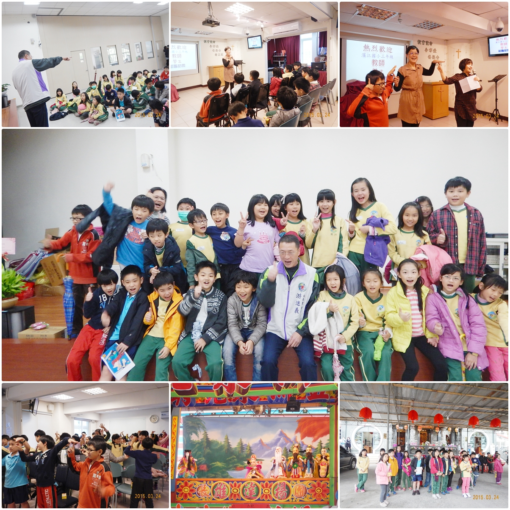
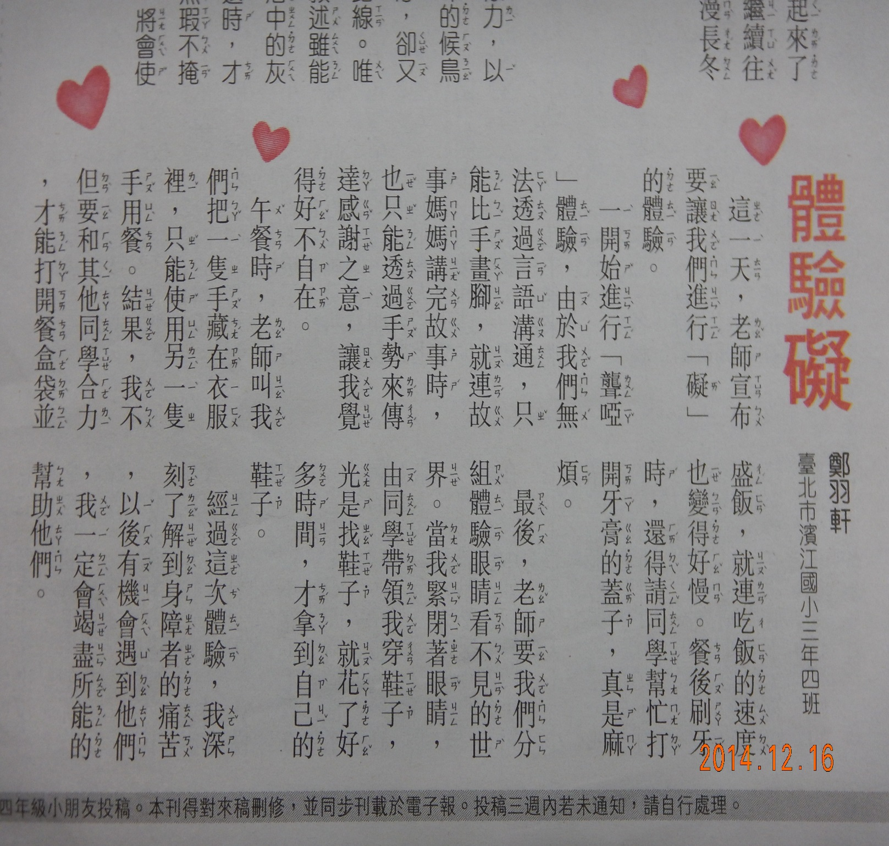
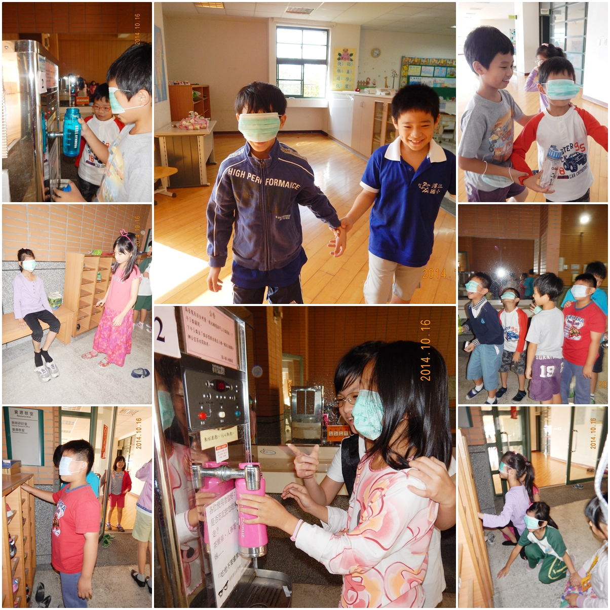
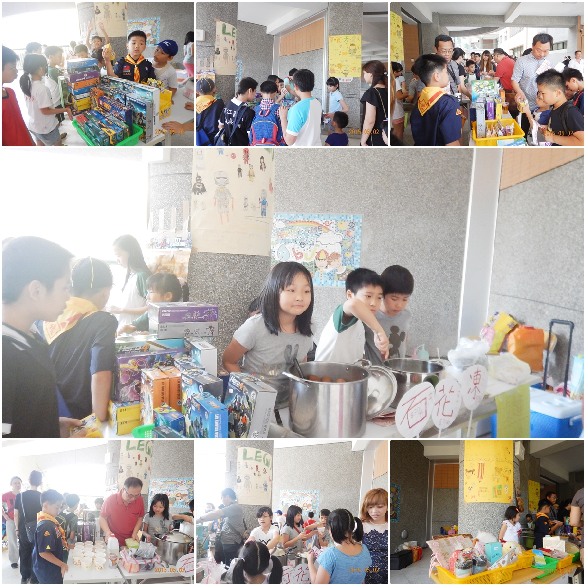
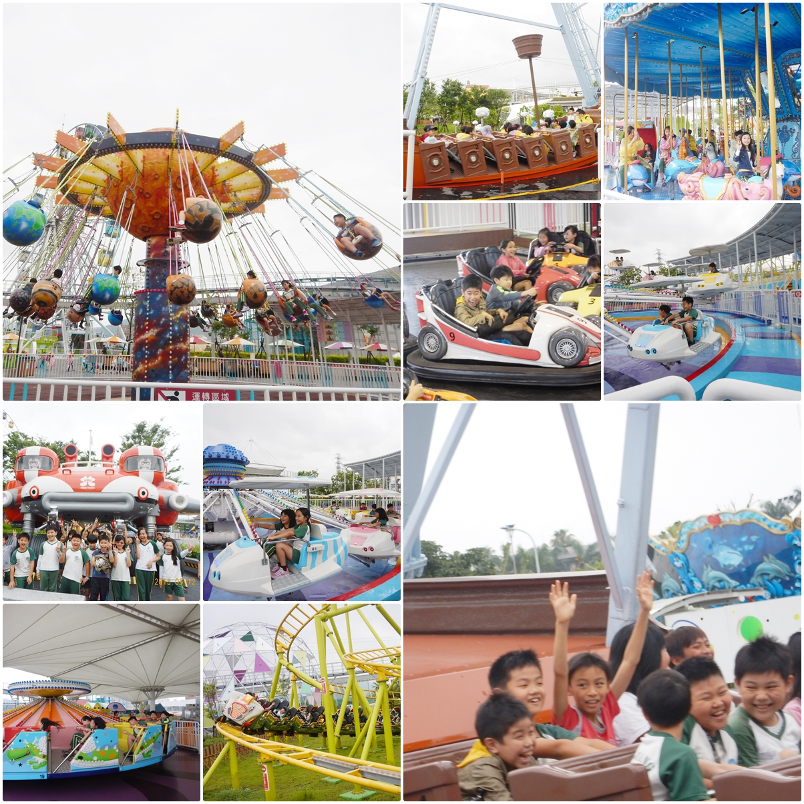
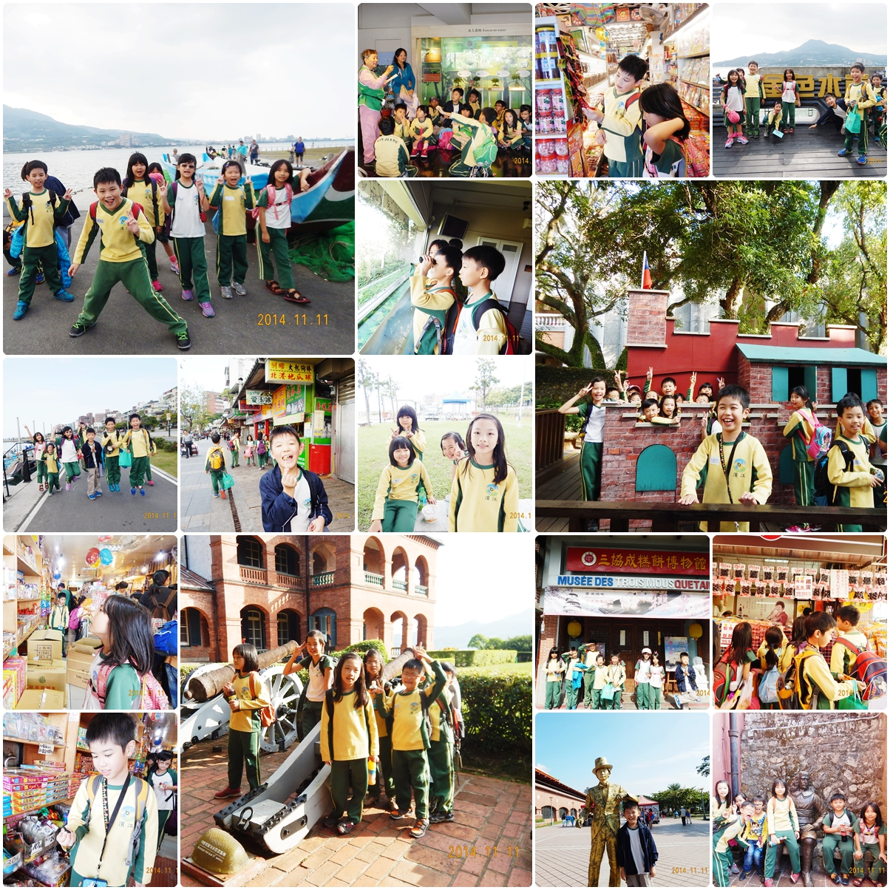
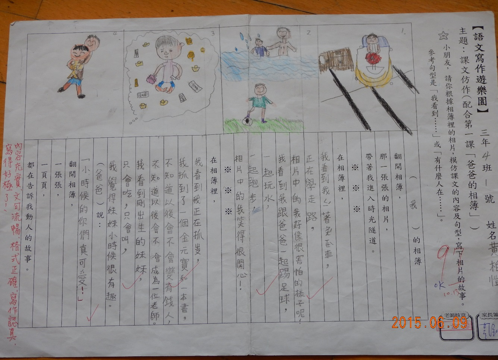
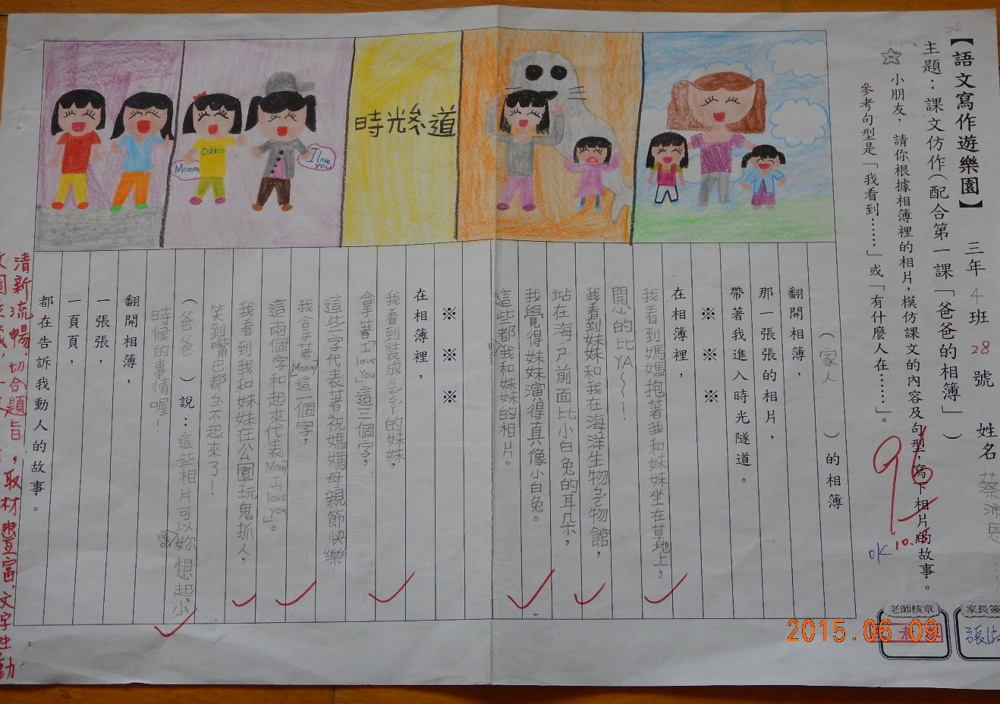

========
三年四班
========

＜社區探索＞陳昀昀
==================
今天的濱江學習課程，我們進行了社區探訪活動，我們去了三個地方，第一個是金泰里里民活動中心，第二個地方是大直真理堂，第三個地方是下塔悠福德爺廟。

當我們到達里民活動中心後，里長說：想問什麼問題，儘管問！大家都問了各式各樣的問題，里長都一一回答了。臨走前，里長還送我們一人一杯果汁呢！

接下來，我們去大直真理堂，那裡的阿姨不但熱心的招待我們，還跟我們玩遊戲，如果獲勝還有獎品呢！臨走前，他們也送我們果汁呢！

最後，我們去了下塔悠福德爺廟，我們先去拜土地公，然後老師介紹各種拜拜工具，譬如：擲茭。我們大致看完下塔悠福德爺廟後，就去看布袋戲，雖然完全看不懂，但是今天也讓我學到了許多知識。

 
＜〔礙〕的體驗＞劉宇璇
======================
劉大潭叔叔曾經講過，他的身體行動起來很不方便。老師為了讓我們體驗身障者的感受，所以我們要進行聾啞體驗。我覺得好可怕，不知道我會不會通過考驗呢？

活動一：不能說話，只能比手畫腳或寫信，連玩都只能比手畫腳，真是很不方便的一件事情，就像是動物一樣不能說出牠們想說的話。我們真是可憐啊!

活動二：有一隻手斷臂，飲用乳品的時候，只能用左手拿著乳品，再用牙齒咬下去，還有吃飯不能手扶著碗，只能用湯匙慢慢吃飯，真是好困難啊！

活動三：眼睛看不見，同學帶著我到換鞋區，我好害怕，怕撞到門，還有去裝水我覺得好恐怖，怕按錯鈕，真是好可怕喔！

我覺得這些活動都很不方便，如果看見身障者有不方便的地方，我會好心的幫助他們，這個活動也讓我知道他們是有多麼痛苦呀！我一定要保護我自己，不要像他們一樣這麼痛苦呀！
 
＜〔礙〕的體驗＞鄭羽軒
======================

＜園遊會＞蔡昀宸
================
5月2日是我們學校的園遊會，我們要賣石花凍、涼麵、摩摩喳喳、茶葉蛋、樂高和二手物品。我是負責販賣二手物的人，我們收集了竹蜻蜓、布偶、日常用品、文具……等物品，希望園遊會可以幫他們找到新家。

＜兒童新樂園＞鍾毅
==================
5月12日我們三年級去兒童新樂園玩，我們玩了很多遊樂設施，其中我最喜歡玩的是旋轉咖啡杯、宇宙迴旋和小飛碟，這是我第一次去遊樂園，我覺得今天很開心。真希望有機會可以多去玩幾次。

＜淡水之旅＞張鈞傑
==================
當老師宣布我們11月11日的校外教學要去淡水的時候，我覺得好開心，因為我沒想到這次校外教學會跑到那麼遠，我後來才知道原來是配合國語第八課「淡水小鎮」。

我們先到紅樹林，下遊覽車以後，我們一直走到一個生態館裡面才停下來，有一個張老師帶我門進入一個小型的電影院裡看了二十分鐘的短片，看完以後還問我們一些小問題，問完以後就開始讓我們自由參觀，大約半小時後，我們跟張老師和其他工作人員道謝以後，我們就離開了這一個生態館。

接下來我們要去吃午餐，我們在淡水找了個陰涼處坐下，享受美味的午餐。吃完午餐後，我們分組前往淡水老街逛街，在看風景的時候，我差點踩到大便，我覺得很噁心，接下來我們和老師一起逛了好多的店，也看到了各式各樣的物品，例如：蜈蚣模型、姓名吊式……等等，我們跟老師撒嬌要鐵蛋吃，老師特意買了超入味的破皮鐵蛋，這盒鐵蛋讓我們吃得津津有味，心滿意足，因為真的太好吃了！到最後只剩幾顆的時候，大家開始爭先恐後的搶來吃。

最後，我們去了紅毛城，到了紅毛城以後，有一個姐姐來當我們的導覽員，他帶我們上去一個小山丘，到頂端的時候，我看到了一個超大的建築物，這就是紅毛城！我覺得很驚訝！因為紅毛城牆壁的厚度竟然有一百九十公分，後來我才知道，為什麼要蓋那麼厚，原來是因為大戰的的時候要抵擋大炮的攻擊才會蓋得那麼厚！在這裡我們還看了很多東西，例如：地牢、金庫、焚化爐……等。

我覺得這次的校外教學真好玩！因為我們看到了很多事物，例如：捷運、紅樹林、小船、紅毛城……等，這次的校外教學讓我們大家都玩得不亦樂乎！

＜淡水嬉遊記＞黃翊禎
====================
期盼已久的校外教學終於到來了！昨天晚上，我興奮的睡不著覺呢！天開始慢慢的亮了，我就興高采烈的跳下床，吃完早餐就三步併成兩步，開開心心的跑去學校了，坐上遊覽車，我迫不及待的跟同學聊天，四十分鐘就這樣過去了。

一開始我們先去紅樹林，張老師讓我們看了一段關於大自然的影片，影片內教我們很多知識，例如「吊在枝條上的水筆仔，其實在吸母株的養份呢!」

 吃完午餐後，我們就前往老街喔！突然我看到了一家店，上面的招牌寫「奇奇怪怪大動物」，裡面竟然有犀牛混血豬？因為太噁心了，我們就去下一家店，是大人常懷舊的「雜貨店」，進去以後，我看到了包羅萬象的物品，最吸引我的是彈珠汽水，汽水喝完後又可以拿彈珠，真是「一舉兩得！」

吳倞媽媽請我們吃鐵蛋，大家都狼吞虎嚥的吃完了鐵蛋。

接下來，我們要去傳說風景美不勝收的「紅毛城」，又名「安東尼堡」，裡面竟然有牢房，而且，還有那麼多的國家來到這裡，可是大家都不愛看風景，只注意那台隨處可見的飲料販賣機。

我發現淡水的古蹟真不少，希望下次再來一次，淡水，我會再度光臨的！

    
＜我的心愛寶貝＞郭騏勝
=======================
我有一個很心愛的寶貝，它不是玩具，也不是文具，它是ㄧ支桌球拍，這支球拍是自從我的桌球變厲害之後，教練推薦的，我很喜歡這支桌球拍，因為我出去比賽和練球都需要它，如果它不見了，我一定會寂寞的不得了。

這支桌球拍的握把是深藍色的，還有兩條亮紅色的條紋，看起來很酷！我每次出去打比賽的時候，都是它幫我贏球，讓我享受贏球的快樂，當然，它也一起和我接受輸球，讓我知道輸球的悲傷。

有一次，桌球教練說要打一個桌球隊三、四年級的排名賽，為什麼要打一個三、四年級的排名賽呢？因為教練要取排名賽的第一、二名去打一個叫做少年國手選拔的比賽，可惜，最後教練宣布名次的時候，我沒有在第一、二名裡面，我覺得很失望，但是我想到，他門去那邊比賽不但要花錢，還會不熟悉那個地方呢！

我很喜歡這支球拍，因為除了禮拜天以外，我每天都會需要用到它，它永遠是我的寶貝！

＜美麗的校園＞吳倞
==================
一走進校門口，好像走進了一座「童話王國」，彩虹般的階梯，在陽光下，閃閃發亮，階梯後面的廣場，最有特色的是可愛的「小水滴」，小水滴圓圓胖胖的，下面的底座有十二生肖，真是有趣的組合哇！

濱江的校園雖然不大，但很有特色，也很美麗，處處都是驚喜！我最喜歡的地方是生態池，池水非常清澈，裡面有豐富的生物，那裡是觀察生態的好地方，當妳要在池子旁散步時，要小心，因為地板上有一堆小青蛙！有一次，我和一、兩個朋友去生態池玩，我每踩一步，青蛙就遭殃一次，原來，地上有一堆青蛙已經被我踩成了「青蛙乾」了！

我除了喜歡生態池，也很喜歡圖書館，那裡有豐富的藏書，當我覺得很無聊時，我就會去那裡看小說，每次的收穫都很多，圖書館也會提供學生使用電腦，有些時候，我有一些問題，都會去圖書館找答案，我覺得圖書館真像是一個「藏寶箱」，裡面有很多知識！

我非常喜歡我的校園，處處都是有趣的設計，也很有特色！

＜洋蔥炒牛肉＞霍群倫
====================
每次去阿嬤家時，阿嬤都會為我準備一道我一定要吃的食物，那就是「洋蔥炒牛肉」，那道菜是我最喜歡吃的食物，以前，我生病時什麼都吃不下，我阿嬤就做了這道菜給我吃，從此，我就喜歡上這道菜了！

一片一片咖啡色的牛肉和一絲一絲金黃色的洋蔥，加上那一粒一粒亮黑色的黑胡椒，這就是洋蔥炒牛肉的魅力，再加上華麗的擺盤，跟美妙的香氣，這可以說是世界上最棒最好吃的洋蔥炒牛肉了！它也是我每天最想吃的一道菜。

每次炒洋蔥炒牛肉時，都會有ㄗ、ㄗ、ㄗ的聲音，就像是洋蔥和牛肉在跳著美麗的舞蹈，在這時，有一股香噴噴的味道跑到我的鼻前，好像在跟我說「妳好！」原來，這香味就是洋蔥和胡椒的味道呀！真是芳香四溢、五味俱全啊！

吃到這道洋蔥炒牛肉，我的心理覺得這是世界上最好吃的料理，因為牛肉吃起來很滑順，配上洋蔥的甜味，以及胡椒的微辣，可以說這是世界上最讚的食物，真是讓人看了垂涎三尺、食指大動，這令人垂涎欲滴的美味佳餚是我最愛吃的食物呀！
 
＜我的媽媽＞翁綺蔓
==================
我有一位很棒的媽媽，她長得又高又瘦，鼻子尖尖的，眼睛小小亮亮的，頭髮長長的，真漂亮！我覺得媽媽不管穿什麼衣服都很好看，連頭髮隨便綁也很好看。

我覺得媽媽的個性很溫柔，當我覺得難過時，媽媽就會來安慰我，當我生氣時，媽媽會告訴我，我錯在哪裡？哪裡要改進，有時我沒拿到好成績，媽媽會說：「沒關係，下次要上課專心喔！」這句話變成了媽媽的口頭禪了。

媽媽的興趣是烘焙，有時媽媽會做蛋糕、餅乾、吐司、肉桂捲。媽媽的專長是煮菜，我最喜歡媽媽做的海鮮燉飯、親子動飯、義大利麵、紅燒牛肉麵和日是拉麵，不只這些，還有很多，媽媽做的口味也越來越好了，媽媽還教我怎麼做三明治、煎蛋……等，現在，我也快成為家裡的小廚師了，這都要感謝媽媽！

我要告訴媽媽：謝謝您每天都做那可口好吃的飯菜，我們一家每天都能吃到可口又好吃的佳餚。哇！那麼好吃的菜，讓我每天一想到都流口水了，媽媽最棒了！

＜我的相簿＞黃柏愷
==================

＜我的相簿＞蔡沛恩
==================

