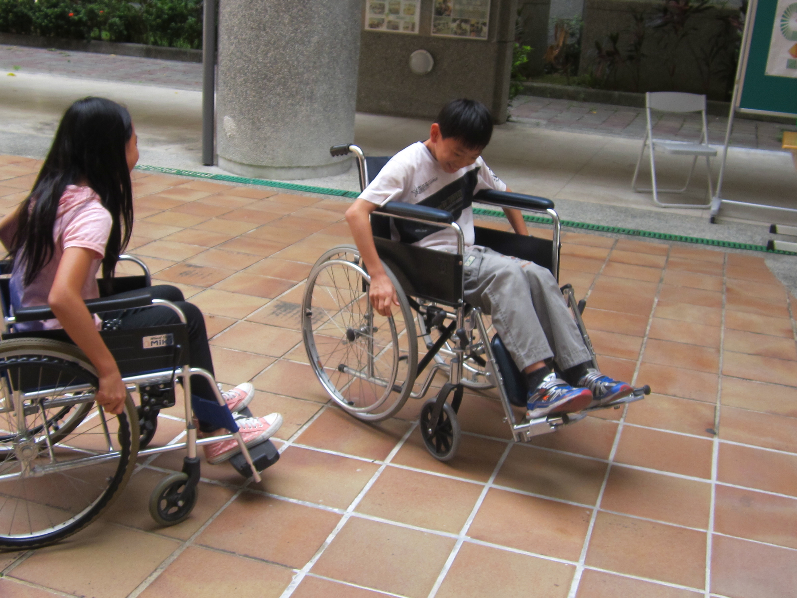

========
五年四班
========

 
【濱江小鐵人】 郭安庭
=====================
這學期，五年級濱江學習的主題是小鐵人，也就是大家耳熟能詳的「鐵人三項」。從三月開始，濱江國小五年級的莘莘學子們，不畏陽光炙人、不畏寒風徹骨都勤奮練習，只為了在今天能披荊斬棘，順利地過關斬將。不論是跑步或游泳，每個人都全力以赴，從原本跑完氣喘如牛、上氣不接下氣的樣子，進步到跑五圈半簡直易如反掌。短短幾周內，能有如此大的轉變，真可說是進步神速呢！游泳也不例外，起初有些人游了幾趟就筋疲力盡、疲憊不堪，但今天已能像魚兒一般在水中穿梭自如，這也是「努力不懈、堅持到底就必有收穫」的一項最佳見證！這個活動的宗旨是要鍛鍊我們的毅力，提升自己的體能及展現非凡的勇氣，並非一朝一夕可以完成，而是需要長時間磨練累積而成。陽光普照的今天，相信各位「小鐵人」都擊敗了重重困難—不論陽光有多麼刺眼、不論路途有多麼遙遠，都一一克服，在運動場上盡情揮汗水，成功獲得這份「小鐵人」的殊榮，同時也為青春寫下精彩的樂章，留下輝煌的一頁。

 
【園遊會】 李心瑀
=================
「快來呦！快來呦！好吃的馬卡龍！還有冰涼的汽水呦！」陣陣的叫賣聲此起彼落好不熱鬧，咦？我是來到菜市場了嗎？哦~原來這裡是濱江國小一年一度的園遊會呀！説到園遊會總是讓人興奮不已，有各式各樣的美食，有趣的遊戲，還有精彩的表演，每個班級無不施展渾身解數，熱鬧萬分。

雖然我們班攤位分配的位置是在資源回收場旁邊，不過我們的熱情依然不減！我們以當紅的「花媽」為海報設計主題，炒熱人氣。推出的商品有色彩繽紛的馬卡龍、濃滑的雞蛋布丁、香噴噴的滷味和汽水，而且我們訂的價格都很便宜，讓人毫不猶豫就拿出園遊券來消費。我們設計的遊戲主題叫「全民快打」這個遊戲就是考驗你的專注力，因為球會突然滾下來，常常會讓人措手不及呢!

半天的園遊會伴隨著歡笑聲結束了，大家都很努力的清理周圍的垃圾，不讓垃圾污染這美麗的校園，同時也響應到環保愛地球。我覺得這次的園遊會很好玩也很有趣!而且在大家分工合作與同心協力下，共同完成這次的活動，覺得同學間的感情也變得更好了呢!

 
【濱江文學賞】 林佑安
=====================
這是一年一度的活動展出盛典，每個年級展現了各異其趣的作品，令人目不暇給！一年級做的注音小書很有創意，會把一個注音符號聯想成很多東西；而二年級的家事學習單，以前我還覺得這個難的要死，但現在卻覺得超簡單的；三年級的母親節小盒子，展現出對母親的愛；四年級的志願和祝福語娃娃，顯現出他們的個性；五年級的平陶作有各種不同的風貌，非常有趣，有人做骷髏頭，有人做豬，甚至還有人做外星人呢！六年級的立體陶作栩栩如生，好像隨時都會活起來。

我最喜歡的東西是六年級的成長小書，我想每個人都一樣吧！我們在看的時侯都目不轉睛，我看了很多本，都覺得很有趣，因為原本以為酷酷的朋友，原來小時候是那麼的可愛。

我每次都很期待濱江文學賞，雖然每次各年級的主題類似，但每個人做出來都有不同的特色。再過一年多我就要畢業了，我會把握最後一次濱江文學賞的作品展出機會，等畢業之後，我也一定會再回到學校欣賞濱江文學賞。

 
【用愛化礙】 蔡佳宇
===================
星期二下午，我們全五年級去體驗「用愛化礙」的活動，我懷著滿心期待的心情，想要趕快體驗一下殘障者的感受。

在闖關時，我覺得每一關都困難重重，其中我覺得最簡單又最好玩的是「乾坤大挪移」，那個關卡的遊戲規則是要使輪椅移動，過程，我覺得最難的部分是轉彎時，需要把輪子控制好，才能夠順利轉彎。雖然那時我覺得很好玩，只不過想到殘障者們無時無刻都要是用輪椅來代替行走，我就立刻收起笑容，不在開玩笑了!

擁有殘障卻還是可以成功!前幾天，我和媽媽看了一部電影，片名是「攻其不備」，主角大麥克(Michael "Big Mike" Oher)是一位患有亞斯伯格症的人，什麼是亞斯伯格症呢?舉個例子:如果你向亞斯伯格症說「借過」，他會說「什麼時候還?」這就是亞斯伯格症，無法和人有效溝通。在電影裡看到的是主角會保護他的家人和主人，也因為這個特質，所以在美式足球隊中，只要他認為隊員們是他的家人，就可以做得非常好了!看完這部電影之後，我發現只要用其他的方式，也可以讓亞斯伯格症的人或是任何殘障者了解你要表達什麼喔!

結束了「用愛化礙」的活動，讓我深深了解了殘障者們的辛苦、努力的過程，現在好手好腳的我們，也更應該突破自己，讓自己的生活更加精采，更加愉快吧!

【那滋味，我永遠記得】 曾子維
=============================
多麼美味的鮭魚麵線哪! 多麼香辣的泡菜呀! 各種食物，都蘊含著各式各樣的獨特味道。那滋味，我永遠記得。

在一個陽光絢麗，不熱也不冷的中午，外婆端著兩晚鮭魚麵，一碗給自己，一碗給我，再加上香脆可口的泡菜，整個人就有如在天堂上享受美食一般，陶醉不已。細長又順口的鮭魚麵線讓吃過的人都讚不絕口，不知不覺令人豎起大拇指。味道香辣又香脆的方塊泡菜，有一種獨特的味道，配上細長的麵線，等於是最佳搭配。

吃食物，不只是為了填飽肚子，也是為了從中尋找樂趣。這種樂趣，要細嚼慢嚥，若是狼吞虎嚥，恐怕是沒辦法感受到這種樂趣。這種味道，也不是旁人所能體會的，唯有慢慢地品嚐，仔細的品味各種食物的味道，才能感受到這種快樂。

可是，令你難忘的味道，有時不只是好吃的而已，有可能也會是自己不喜歡的口味。我也曾經有過一次這樣的經驗。

有一次，爸爸和我一起吃飯時，叫我吃一塊豆腐乳。當時無知的我，直接把它塞進嘴裡。前一秒，我臉色還好好的，說時遲，那時快，後一秒，我完全變成了科學怪人，整個臉都是青綠色的(其實沒有那麼誇張)，似乎快吐了的樣子。這次與豆腐乳的相遇，也是令我牢記在心的經驗。

不管什麼樣的食物，都有他自己獨特的味道。有些可能佳評如潮，有些可能不受喜愛，但每個人都有自己喜歡的味道。那日午後，婆婆的鮭魚麵線，正是我最難忘的佳餚。那滋味，我永遠記得。

【珍惜時間】 蕭嶢
=================
在漢朝的《樂府-長歌行》中有一句話：少壯不努力，老大徒傷悲。我們的青春就像花兒一樣，終究會枯萎，人的生命也是一去不復返，就像我的外公老了過世了，就再也回不來了……

所以我們一定要珍惜光陰，努力向上，免得老了才後悔自己一事無成。

大文學家歐陽修他非常會善用零碎時間，他有一個《三上》的秘訣，就是利用《馬上、廁上、枕上》的時間專心思考，最後成就了許多膾炙人口的佳作。臺灣企業家嚴凱泰，他每天提早一至二小時到公司上班，並將資料、文件仔細分類，所以每天都能迅速又有效率的達成任務，對公司有很大貢獻。

在日常生活中，我們可以利用等車的時間背英文單字或看書，也可以減少打電玩的時間，並且盡量做好事前的時間計畫……等等，這些都是日常生活中珍惜時間的具體做法。

時間就是金錢，珍惜時間就是珍惜金錢。珍惜時間還可以讓我們多做很有益的事，例如：閱讀、休閒運動、幫忙做家事、當志工去幫助需要幫助的人……等等。所以一寸光陰一寸金，寸金難買寸光陰，我們要好好珍惜時間，養成今日事今日畢的好習慣，才不會老大徒傷悲喔！

【夏綠蒂的網讀書報告】 謝雨彤
=============================
基本資料:

書名:夏綠蒂的網作者:懷特譯者:黃可凡

出版者:聯經出版社出版年月:西元二零零四年 一月

內容提要:

豬圈裡，小豬誕生了，但其中有一隻瘦弱嬌小的豬， 芬兒的爸爸本來要把牠殺了，可是芬兒及時趕到，救了牠一命。芬兒養了那隻豬，並且幫牠取名叫「韋柏」，可是芬兒爸媽後來不想養了，所以就特地賣給叔叔！而芬兒的叔叔打算在聖誕節那天把韋伯殺了 ，可是在芬兒叔叔的豬圈裡，韋伯認識了一個聰明伶俐的朋友，名叫──夏綠蒂，牠是一隻蜘蛛，夏綠蒂說願意救韋伯，所以牠想到想到了一個辦法，就是在牠網上寫字，讓人覺得他是一隻特別的豬，所以就不會被殺了。後來夏綠蒂因產卵，所以死了。

讀後感想:

故事中有一小段描述韋伯準備要被芬兒的叔叔殺了， 而如果那個人是我的話，我會想盡辦法讓芬兒的叔叔覺得我是一隻獨一無二的豬，那我要怎麼做呢？我會用盡全身的力氣耍特技，例如:翻滾、跳躍、後空翻……，讓自己可以逃過一劫。我覺得這本書要告訴我們的啟示是:人生中一定會又一個跟你最要好的朋友，可是當他有需要幫助時，你就要「患難見真情」的救他一命，這樣的話你們的友情會更上一層樓，但如果你沒有這樣做的話你們的友情也可能因此結束，而當以後需要幫助時，不會有人救你，所以要好好珍惜你生命中所有的好朋友。

【早發白帝城-李白逃亡記】 鍾定澄
================================
「冤枉啊!大人!」李白我痛哭失聲，碰!牢不可破的鐵門被獄卒關上，外面有六個拿著大刀，長的兇殘無比的士兵輪流看守著。夜黑風高的晚上,微弱的月光從窗口斜斜映照近來，監牢外潺潺的流水聲，不禁讓我想起遠方的江陵和親朋好友們，此刻便淚流滿面。 

大將軍──郭子儀一聽到這個消息後，馬上夜以繼日地搭快艇來救我，中途還遇到三位壯士也自稱要來搭救，郭將軍讓他們一起上船。「唉!今天就是被處死的日子了，死到臨頭，還是必須想個辦法逃出去才對。」殺─碰!碰!這時，槍聲四起，監獄彷彿變成了地獄，橫屍遍野、血流成河。突然有人闖進來，把牢房撐開就跑，可見他力大無窮。後來，我撿到一把長刀，就殺出一條血路，往監獄外衝去，只見槍砲聲此起彼落，有一個很熟悉的人影在戰場上穿梭著。

我走進往前一看，大叫著:「郭將軍!」他一聽到我響徹雲霄的叫聲，立刻風也似的奔向我，我也以迅雷不及掩耳的速度衝過去，兩人一見面，不禁喜極而泣。不過兩旁的士兵正朝我們跑來，我們一見連忙奔到長江邊，這時郭將軍不顧自身安危的把我推上船。唰!他滿口鮮血，三位壯士發出咆哮聲，把郭將軍身後全部的士兵一次砍死，但已經來不及了!郭將軍有氣無力的說：「李大人，我身上這瓶酒給你吧!它會對你很有幫助的!」說完就不省人事。我哭笑不得的說：「老朋友，都什麼時候了，哪還有時間喝酒!」

最後我只好和三位壯士把他埋葬在旁邊的樹下。就上船要回老家江陵，這時，遠方開來一艘戰艦，轟!地朝我們開砲，我不慌不忙的丟出酒瓶，戰艦馬上爆炸往下沉。不久，長江兩岸的猿猴，嘰嘰嘎嘎叫著，好像在幫我們祝賀，這時我文思泉湧，便寫下了一首詩： 

::
    早發白帝城
    朝辭白帝彩雲間，千里江陵一日還，
    兩岸猿聲啼不住，輕舟已過萬重山。

【早發白帝城-李白逃亡記】 陳熙
==============================
一個夜深人靜的傍晚，月亮高高掛在滿天星斗中，多麼美麗地景色啊!而我只能在牢裡，什麼人?一陣打鬥聲傳來，我走到牢邊，只見兩名獄卒倒臥在血泊中，扛著又來一次，就這樣一直反覆幾次，我走到牢門邊，突然嚇一跳，一名黑衣客把獄卒殺得血流成河，那黑衣客依稀像是某人的面孔，似像非像，似是非是，啊!我想起來了，是我於他有恩的郭子儀!

子儀率領本部人馬來救我了，官兵飛也似的跑來，邊喊:「奉聖旨，捉拿侵犯李白，讓開，大理寺辦案，讓道!」，我一個文人，竟然要大理寺來查，真是小題大作了，除了子儀外，一定還有其他人在暗中幫助我，有位隊長認識我，便大喊:「李白在這!」子儀立刻抽出兵刃，使出辟邪劍法，在大道上的人也加入戰團，原來他們就是暗助於我的人，他們各個身懷絕技，但寡不敵眾，很快就被包圍了，官兵們愈戰愈多，我不知哪來的勇氣，從地上拾起一把劍，向官兵砍去，我方多使地堂劍法，官兵紛紛倒下，剩下了一人，我們採取包圍戰術，但那大和習得風清陽的獨孤九劍，我們奈何不了他，便往東、西逃去，東門有官兵，往東門逃的半路就折返，又遇見了那大漢，官兵追地愈來愈近，子儀和那大漢拚了，當悍鬥之際，我拿出弓，瞄準那大漢，發射!那大漢就被我殺了，其餘的官兵便逃之夭夭了。

我思鄉心切官兵追殺，所以走水路，我離開了白帝城到了我的故鄉江陵。為了紀念這次逃獄成功，我寫了這一首詩：

::
    早發白帝城
    朝辭白帝彩雲間，千里江陵一日還；
    兩岸猿聲啼不住，輕舟已過萬重山。

【運動的樂趣】 馬保嘉
=====================
泰戈爾說：「靜止便是死亡，只有運動才能打開永生的大門」

不就是說要多運動才能永保健康嗎？我們也要多運動。什麼是運動呢？簡單來說，就是「長時間可以讓人類的動作」，像是棒球、籃球、高爾夫、足球，連最簡單的跑步也是運動。

運動有什麼好處呢？我覺得運動給我的好處很多，可以增加心肺功能、讓人更有活力，連患有癌症的機率也大大減少喔！而且運動讓我增加了自信心。我覺得運動也有很多樂趣，可以讓人覺得開心、快樂，像棒球、籃球和足球等多人合作的運動還可以交朋友，這，也是「樂趣」的一種吧！

我最喜歡打棒球了！可以讓我覺得開心，也讓我放鬆、壓力零，最開心還是可以交朋友了！王建民是一個喜歡棒球，也把球打得很好的人，他也覺得棒球是一件「好玩、快樂的事情」，並讓他放鬆，就全心全力的打棒球了。

達•芬奇說：「運動是一切生命的泉源」，我們如果想要健健康康、快快樂樂的，就要多運動。最後，運動到底有什麼樂趣呢？為什麼要運動呢？運動有非常多樂趣，讓人快樂、開心、沒壓力……而且運動是維持健康的「唯一」方式，要是不運動，小心了，死神要來帶走你了！堪稱一舉數得，何樂而不為呢？

【運動的樂趣】 郭子筠
=====================
愛因斯坦曾說：「我生平喜歡步行，運動帶給我無窮的的樂趣」，不管是音樂家、發明家、作家、醫生、服務生……，都必須運動。世界上有很多種運動，陸地上的運動有：跑步、跳繩、搖呼啦圈……，球類運動有：棒球、籃球、高爾夫球、羽球、排球……，水上運動有：游泳、水上芭蕾、衝浪、划船……，這些都是良好的運動。

運動有很多好處，運動會讓身體促進血液循環也可以消耗身體過多的熱量，這對過胖的人很有幫助。而對精神上來說能令人更有活力也能更有精神，工作能更有效率，還能讓自己整個開心起來，可見運動真是件有益身心的事啊！不同種類的運動有不同的樂趣，像跑步，是個可以跟別人比賽的的運動，可以用計時的方式看看自己跑幾秒，或用接力的方式看看團隊和不和諧，如衝浪，你可以邊運動邊欣賞自己濺出的水花有多高、有多美，或搖呼啦圈，你可以和別人比賽看誰可以搖最久，還可以發明「花式呼啦圈」呢！

我們家喜歡從事的運動有很多，如：高爾夫球、散步、跑步、游泳、籃球、躲避球、足球、羽球……，這些運動讓我們過得很美滿。

令我敬佩的一位運動明星，國籍在臺灣，是住在美國佛洲的臺灣人—曾雅妮，她的職業是打高爾夫球，她從小就開始打球，所以在LPGA錦標賽 (2008、2011)、納貝斯克錦標賽 (2010)、英國女子公開賽 (2010、2011)、ANZ女子高球名人賽中奪冠，另外她也是臺灣第一位登上主流運動世界排名第一名的運動員呢！

泰戈爾說：「靜止便是死亡，只有運動才能敲開永生的大門」，每個人都要運動，在運動的過程中，你可以得到很多樂趣。運動使人過得開心，使人過得美滿，使人過得充實，所以運動真是件極為重要的事呢！
 
【歡送畢業生】 郭恩翎
=====================

 
【歡送畢業生】 陳沂柔
=====================

【歡送畢業生】 鄭楷騰
=====================

 

