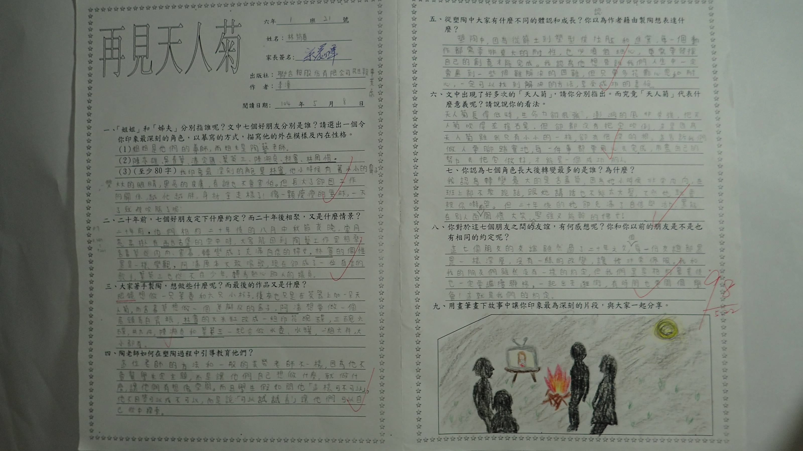

========
六年一班
========

    再見天人菊-林筠真

    再見天人菊-謝承妤

    再見天人菊-高胤宸

    寫給童年的一封信-蔡銘元

    寫給童年的一封信-賴禹蓁

    愛的真諦-林筠真

    愛的真諦-賴禹蓁

    故事改編-周真臻

    故事改編-蔡銘元

    記憶傳授人-劉尚頣

    記憶傳授人-謝承妤

    記憶傳授人-陳莛閎

    誠實的重要-張睿騏

    誠實的重要-謝昕妤

    誠實的重要-陳莛閎
